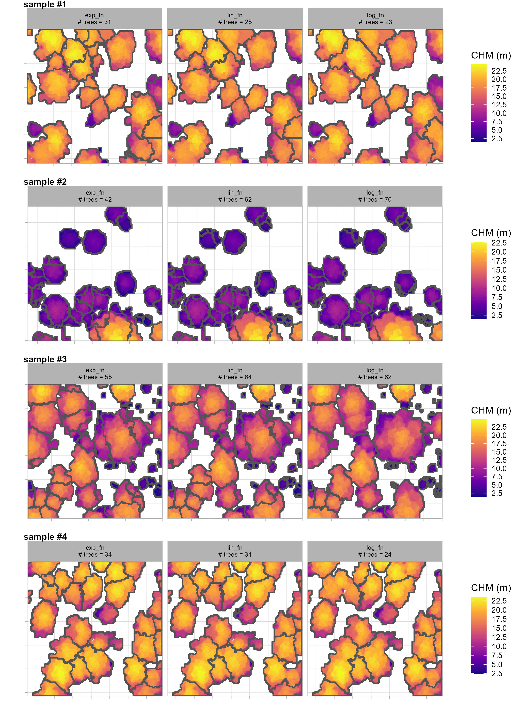
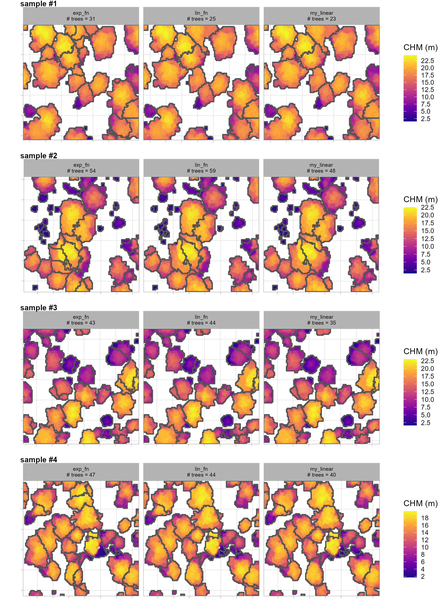
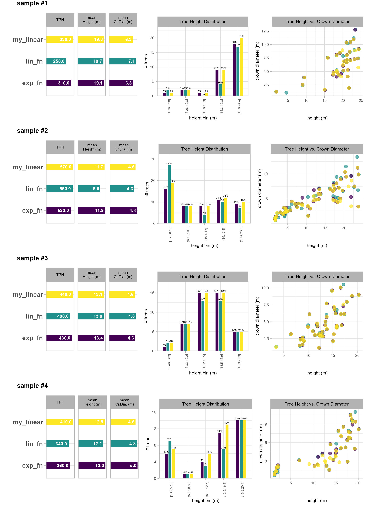
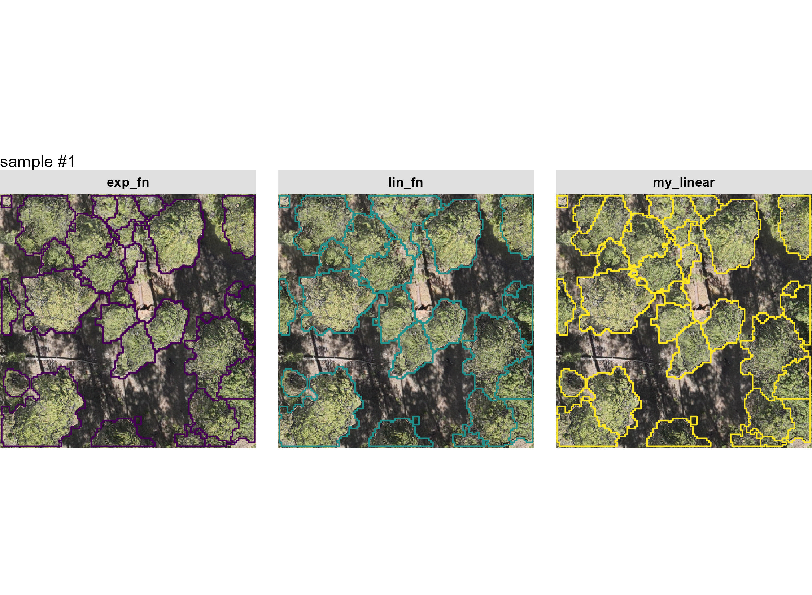
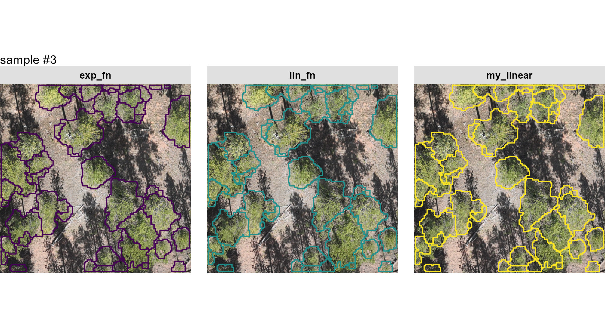

```{r, include=FALSE, warning=F, message=F}
################################################
##```{r,eval=T
################################################
# clean session
remove(list = ls())
gc()
# knit options
knitr::opts_chunk$set(
  echo = TRUE
  , warning = FALSE
  , message = FALSE
  # , results = 'hide'
  , fig.width = 10.5
  , fig.height = 7
)
# option to put satellite imagery as base layer of mapview maps
  mapview::mapviewOptions(
    homebutton = FALSE
    # , basemaps = c("Esri.WorldImagery","OpenStreetMap")
    , basemaps = c("OpenStreetMap", "Esri.WorldImagery")
  )
```

# Data

load the standard libraries we use to do work 

```{r}
# bread-and-butter
library(tidyverse) # the tidyverse
library(viridis) # viridis colors
library(harrypotter) # hp colors
library(palettetown) # poke colors
library(RColorBrewer) # brewer colors
library(scales) # work with number and plot scales
library(latex2exp)

# visualization
library(mapview) # interactive html maps
library(kableExtra) # tables
library(patchwork) # combine plots
library(ggnewscale) # new scale
library(ggrepel) # repel labels

# spatial analysis
library(terra) # raster
library(sf) # simple features
library(lidR) # lidR
library(cloud2trees) # cloud2trees
```

```{r, warning=FALSE, message=FALSE, echo=FALSE, include=FALSE}
remove(list = ls()[grep("_temp",ls())])
gc()
```

Though not necessary for `cloud2trees` data processing, let's quickly check out the location and structure of the data we have

we got a folder of point cloud data: *N1_400AGL_20MPH_TFOFF* ... let's see what's in that folder

```{r,eval=T,purl=FALSE}
# directory with the downloaded .las|.laz files
point_cld_folder <- "../data/N1_400AGL_20MPH_TFOFF"
# is there data?
list.files(point_cld_folder, pattern = ".*\\.(laz|las)$") %>% length()
# what files are in here?
list.files(point_cld_folder, pattern = ".*\\.(laz|las)$")[1]
```

again, this is not necessary for `cloud2trees` data processing but we can use `lidR` to read the point cloud folder as a catalog which doesn't read in the actual points but just the point cloud header data which includes information on things like the spatial location of the data, the point density, and other point attributes

```{r,eval=T,purl=FALSE}
# read folder as LAScatalog
ctg_temp <- lidR::readLAScatalog(point_cld_folder)
# what information do we get about the point cloud?
ctg_temp
```

that's a lot of points...can an ordinary or sub-optimal laptop handle it? we'll find out.

let's look at the point cloud extent on a map to orient ourselves in space

```{r,eval=T,purl=FALSE}
ctg_temp %>% 
  cloud2trees:::check_las_ctg_empty() %>% 
  purrr::pluck("data") %>% 
  mapview::mapview(popup = F, layer.name = "point cloud tile")
```

i told you that we didn't need to do any of that for `cloud2trees` data processing and to prove it, we'll remove the `ctg_temp` object from our session

```{r, warning=FALSE, message=FALSE}
remove(list = ls()[grep("_temp",ls())])
gc()
```

```{r,include=FALSE,eval=FALSE}
#### pc extent vs rgb rast
rgb_rast_fnm <- "../data/dom/dom.tif"
rgb_rast <- terra::rast(rgb_rast_fnm) 
rgb_rast %>% 
  terra::subset(c(1,2,3)) %>% 
  terra::plotRGB()
ctg_temp %>% 
  cloud2trees:::check_las_ctg_empty() %>% 
  purrr::pluck("data") %>% 
  sf::st_transform(terra::crs(rgb_rast)) %>% 
  terra::vect() %>% 
  terra::plot(add = T, col = NA, border = "gold", lwd = 3)
```

# ITD Tuning

from the `cloud2trees` readme:

>The `itd_tuning()` function is used to visually assess tree crown delineation results from different window size functions used for the detection of individual trees. `itd_tuning()` allows users to test different window size functions on a sample of data to determine which function is most suitable for the area being analyzed. The preferred function can then be used in the `ws` parameter in `raster2trees()` and `cloud2trees()`.

let's take this `cloud2trees::itd_tuning()` function for a spin with the parameter settings `chm_res_m = 0.25` since we plan on processing the entire data extent using a 0.25 m CHM resolution, `n_samples = 4` to get four 0.1 ha sample areas on which to visually assess the window functions, and `min_height = 1.37` to require that any potential tree has a height of at least 1.37 m to be considered a "tree"

```{r, include=TRUE, eval=FALSE}
itd_tuning_ans <- 
  cloud2trees::itd_tuning(
    input_las_dir = "../data/N1_400AGL_20MPH_TFOFF/"
    , n_samples = 4
    , min_height = 1.37
    , chm_res_m = 0.25
  )
```

```{r, include=F, eval=T, echo=F}
itd_tuning_ans <- 
  cloud2trees::itd_tuning(
    input_las_dir = "../data/N1_400AGL_20MPH_TFOFF/"
    , n_samples = 1
    , min_height = 2
    , chm_res_m = 0.25
  )
```

what does `cloud2trees::itd_tuning()` give us?

```{r}
names(itd_tuning_ans)
```

it's a named list. let's check out the `plot_*` results

```{r, include=T, eval = FALSE}
itd_tuning_ans$plot_samples
# write the file to the disk for posterity
ggplot2::ggsave(filename = "../data/itd_tuning_plot_samples1.jpg", height = 11, width = 8, dpi = "print")
```

```{r, echo=FALSE, out.width="80%", out.height="80%", fig.align='center', fig.show='hold',results='asis'}

```

the most noticeable difference between the window functions is with the segmentation of tall areas of the CHM using the `log_fn` compared to the other two. this function appears to not be separating tall trees appropriately: it is under-segmenting these areas resulting in too few tall trees. this under-segmentation by the `log_fn` can be seen most clearly in the top-left tall tree group of sample 1 and the top-left tall tree group of sample 4

comparing the `lin_fn` (linear function) and `exp_fn` (exponential function) shows that both functions result in similar segmentation results for taller trees but the primary differences appear for shorter trees. The difference in short-tree segmentation between these two functions is most evident in sample 2 where the `lin_fn` predicts many more small trees than the `exp_fn`. This appears to be an over-segmentation (too many trees) by the `lin_fn` for shorter trees which is perhaps most clear in the area just above the very center of sample 2

let's check out the resulting tree distribution of the different window functions over these sample areas

```{r, include=T, eval = FALSE}
itd_tuning_ans$plot_sample_summary
# write the file to the disk for posterity
ggplot2::ggsave(filename = "../data/itd_tuning_plot_sample_summary1.jpg", height = 11, width = 8, dpi = "print")
```

```{r, echo=FALSE, out.width="80%", out.height="80%", fig.align='center', fig.show='hold',results='asis'}
knitr::include_graphics("../data/itd_tuning_plot_sample_summary1.jpg")
```

these results confirm what we identified about the `log_fn` compared to the other two: that it under-segments taller trees. predicting too few tall trees by not separating multiple tree crowns has the effect of producing tall trees with very wide crowns. this result is shown by the outlier yellow points in the RHS plots where the crown is predicted to be wider than the tree is tall (unlikely for this forest type)

let's look at the default window function named `lin_fn` (i.e. linear function) from `cloud2trees` to see how we might adjust it to obtain different tree segmentation results

```{r}
itd_tuning_ans$ws_fn_list$lin_fn
```

it's a function defining the window size (called `y`) based on the CHM height (called `x`)

we can plot the two functions that we did not rule out based on the first set of `cloud2trees::itd_tuning()` samples

```{r}
# plot the ws fn
ggplot2::ggplot() +
  ggplot2::geom_function(fun = itd_tuning_ans$ws_fn_list$lin_fn, aes(color = "lin_fn"), lwd = 1) +
  ggplot2::geom_function(fun = itd_tuning_ans$ws_fn_list$exp_fn, aes(color = "exp_fn"), lwd = 1) +
  ggplot2::xlim(-5,42) +
  ggplot2::labs(x = "heights", y = "ws", color = "") +
  ggplot2::theme_light()
```

the `lin_fn` (linear function) and `exp_fn` (exponential function) result in similar window sizes for higher CHM values but the `exp_fn` expands the window size for shorter areas compared to the `lin_fn`. 

let's make a custom linear function that expands the search window for shorter trees but keeps roughly the same window size for taller trees between 15-25 m (we don't expect many trees above this in our study area). looking at the plot of the two functions, we want to make a new, piecewise linear function that passes through (4,1.5) which is a point between the `exp_fn` and `lin_fn` in the 2-7.5 x-range

```{r}
# define a custom function
my_linear <- function(x){
    y <- dplyr::case_when(
      is.na(x) ~ 0.001
      , x < 0 ~ 0.001
      , x < 1.5 ~ 1 # (1.5,1) is connection for the next piece
      # next piece:
        # we want it to pass through ~ (4.0,1.5)
        # m = (y2-y1)/(x2-x1) >> m = (1.5-1)/(4.0-1.5) = 0.20
        # b = y-(m*x) >> b = 1-(0.20*1.5) = 0.70
      , x < 4.0 ~ 0.70 + x*0.20 
      # next piece:
        # at x=4.0, first segment y = 0.70+4.0*0.20 = 1.5 >> (4.0,1.5)
        # connect to (20,2.85)
        # m = (2.85-1.5)/(20-4.0) = 0.084375
        # b = 1.5-(0.084375*4.0) = 1.1625
      , x < 20 ~ 1.1625 + x*0.084375
      # upper limit starts at (65,5)
      , x > 55 ~ 5
      # next piece:
        # at x=20, first segment y = 1.1625 + 20*0.084375 = 2.85 >> (20,2.85)
        # connect to (55,5)
        # m = (5-2.85)/(55-20) = 0.06142857
        # b = 2.85-(0.06142857*20) = 1.621429
      , T ~ 1.621429 + x*0.06142857
    )
    return(y)
}
```

```{r, include = F, eval = F}
my_linear <- function(x){
    y <- dplyr::case_when(
      is.na(x) ~ 0.001
      , x < 0 ~ 0.001
      , x < 1.5 ~ 1 # (1.5,1) is connection for the next piece
      # next piece:
        # we want it to pass through ~ (3.5,1.5)
        # m = (y2-y1)/(x2-x1) >> m = (1.5-1)/(3.5-1.5) = 0.25
        # b = y-(m*x) >> b = 1-(0.25*1.5) = 0.625
      , x < 7 ~ 0.625 + x*0.25 
      # upper limit starts at (35,5)
      , x > 35 ~ 5
      # next piece:
        # at x=7, first segment y = 0.625+7*0.25 = 2.375 >> (7,2.375)
        # connect to (35,5)
        # m = (5-2.375)/(35-7) = 0.09375
        # b = 2.375-(0.09375*7) = 1.71875
        # 7 <= x < 35
      , T ~ 1.71875 + x*0.09375
    )
    return(y)
}

```

let's visualize these functions we'll use for the second `cloud2trees::itd_tuning()` sampling

```{r}
ggplot2::ggplot() +
  ggplot2::geom_function(fun = itd_tuning_ans$ws_fn_list$lin_fn, aes(color = "lin_fn"), lwd = 1) +
  ggplot2::geom_function(fun = itd_tuning_ans$ws_fn_list$exp_fn, aes(color = "exp_fn"), lwd = 1) +
  ggplot2::geom_function(fun = my_linear, aes(color = "my_linear"), lwd = 1) +
  ggplot2::xlim(-5,35) +
  ggplot2::labs(x = "heights", y = "ws", color = "") +
  ggplot2::theme_light()
```

re-run tuning with new function

```{r, include=TRUE, eval=FALSE}
# let's put these in a list to test with the best default function we saved from above
my_fn_list <- list(
  lin_fn = cloud2trees::itd_ws_functions()[["lin_fn"]]
  , exp_fn = cloud2trees::itd_ws_functions()[["exp_fn"]]
  , my_linear = my_linear
)
itd_tuning_ans2 <- 
  cloud2trees::itd_tuning(
    input_las_dir = "../data/N1_400AGL_20MPH_TFOFF/"
    , ws_fn_list = my_fn_list
    , n_samples = 4
    , min_height = 1.37
    , chm_res_m = 0.25
  )
```

let's check out the `plot_*` results

```{r, include=T, eval = FALSE}
itd_tuning_ans2$plot_samples
# write the file to the disk for posterity
ggplot2::ggsave(filename = "../data/itd_tuning_plot_samples2.jpg", height = 11, width = 8, dpi = "print")
```

```{r, echo=FALSE, out.width="80%", out.height="80%", fig.align='center', fig.show='hold',results='asis'}

```

Our custom `my_linear` function appears to do a good job striking a balance between the default `lin_fn` which tended to undersegment taller trees an the `exp_fn` which tended to undersegment shorter trees. The custom function and the `exp_fn` yield similar tree segmentation results for sample 1 which is what we expected since that area consists primarily of taller trees and the biggest change we made to `my_linear` function was to limit the search window at the taller range and expand the search window for shorter trees so that less were detected compared to the default `lin_fn`. One notable difference with the `exp_fn` (exponential function) in sample 1 is in the lower left corner where the custom function limited crown sprawl for one of the taller objects in the scene an yielded more realistic crown shapes. Our custom `my_linear` function yields fewer small trees than the default `lin_fn` (but more than the `exp_fn`) since we allowed a larger window size at lower portions of the CHM with this effect most clear for the short trees (purple CHM regions) on sample 2.

let's check out the resulting tree distribution of the different window functions over these sample areas

```{r, include=T, eval = FALSE}
itd_tuning_ans2$plot_sample_summary
# write the file to the disk for posterity
ggplot2::ggsave(filename = "../data/itd_tuning_plot_sample_summary2.jpg", height = 11, width = 8, dpi = "print")
# save the crowns too?
itd_tuning_ans2$crowns %>% sf::st_write(dsn = "../data/itd_tuning_crowns.gpkg", quiet = T, append = F) 
```

```{r, echo=FALSE, out.width="80%", out.height="80%", fig.align='center', fig.show='hold',results='asis'}

# this is after we've already run the itd_tuning_ans2
itd_tuning_ans2 <- list(crowns = NULL)
itd_tuning_ans2$crowns <- sf::st_read("../data/itd_tuning_crowns.gpkg", quiet = T)
```

let's check out the crown polygon data we got from our second `itd_tuining()` iteration

```{r}
itd_tuning_ans2$crowns %>% dplyr::glimpse()
```

this data includes the crown polygons for each window function and 0.1 ha sample plot

```{r}
itd_tuning_ans2$crowns %>% 
  sf::st_drop_geometry() %>% 
  dplyr::count(sample_number,ws_fn)
```

let's investigate the suspicious segments where crown diameter is greater than the tree height but limit our search to only trees > 2m in height since it is believable that a 5 foot tree could have a 5 foot crown diameter but it is not believable that a 90 foot tree could have a 90 foot crown diameter, for example

```{r}
itd_tuning_ans2$crowns %>% 
  sf::st_drop_geometry() %>% 
  dplyr::filter(
    crown_diameter_m>tree_height_m &
    tree_height_m>2
  ) %>%
  dplyr::count(sample_number,ws_fn)
```

the `exp_fn` predicts a single tree with a crown diameter greater than height, let's see the tree details for those questionable predictions

```{r}
itd_tuning_ans2$crowns %>% 
  dplyr::filter(
    crown_diameter_m>tree_height_m &
    tree_height_m>2
  ) %>%
  dplyr::select(sample_number,ws_fn,tree_height_m,crown_diameter_m,tree_x,tree_y)
```

let's check the geometry types

```{r}
sf::st_geometry_type(itd_tuning_ans2$crowns) %>% 
  droplevels() %>% 
  table()
```

note that there are `MULTIPOLYGON` geometries which means that the tree crown is, potentially, not a continuous, wholly connected object. This result is common when using rasterized data since the raster cells have potential to "connect" at the corners during segmentation. `cloud2trees` has functionality to handle these `MULTIPOLYGON` geometries by selecting the largest area polygon part by predicted segment (i.e. `treeID` from `cloud2trees`). let's simplify the `MULTIPOLYGON` geometries, calculate the diameter of the new, simplified geometries

```{r}
crowns_simplified <- itd_tuning_ans2$crowns %>% 
  # we're going to replace the treeID to ensure we have a 
  # unique identifier since the data is a special case where 
  # trees were segmented differently on the same geographic area
  dplyr::ungroup() %>% 
  dplyr::mutate(treeID = dplyr::row_number()) %>% 
  cloud2trees::simplify_multipolygon_crowns() %>% 
  # get the diameter which will be named `diameter_m`
  cloud2trees:::st_calculate_diameter() %>% 
  dplyr::select(-crown_diameter_m) %>% 
  dplyr::rename(crown_diameter_m=diameter_m)
# crowns_simplified %>% dplyr::glimpse()
```

we should have the same number of predicted trees

```{r}
identical(
  nrow(crowns_simplified)
  , nrow(itd_tuning_ans2$crowns)
)
```

we can verify the geometry type in the data now

```{r}
sf::st_geometry_type(crowns_simplified) %>% 
  droplevels() %>% 
  table()
```

now let's look for trees where the where crown diameter is greater than the tree height but limit our search to only trees > 2m in height

```{r}
crowns_simplified %>% 
  sf::st_drop_geometry() %>% 
  dplyr::filter(
    crown_diameter_m>tree_height_m &
    tree_height_m>2
  ) %>%
  dplyr::count(sample_number,ws_fn)
```

now there is only a single record from the `exp_fn` where the crown diameter is larger than the tree height. let's look at the specific record

```{r}
crowns_simplified %>% 
  sf::st_drop_geometry() %>% 
  dplyr::filter(
    crown_diameter_m>tree_height_m &
    tree_height_m>2
  ) %>%
  dplyr::select(sample_number,ws_fn,tree_height_m,crown_diameter_m,tree_x,tree_y)
```

the diameter is barely larger than the height for this record which is a relatively small tree...seems like the issue is resolved

```{r,include=F,eval=FALSE}
crowns_simplified %>% 
  sf::st_drop_geometry() %>% 
  dplyr::filter(treeID %in% c(200,147,166)) %>% 
  dplyr::select(sample_number,ws_fn,treeID,tree_height_m,crown_diameter_m,tree_x,tree_y)
# start with the sample plot extent
crowns_simplified %>% 
  dplyr::filter(sample_number==2) %>% 
  sf::st_union() %>% 
  sf::st_bbox() %>% 
  sf::st_as_sfc() %>% 
  sf::st_buffer(0.1) %>% 
  ggplot2::ggplot() +
  ggplot2::geom_sf(color = "black", fill = NA) +
  ggplot2::geom_sf(
    data = crowns_simplified %>%
      dplyr::filter(
        sample_number==2
        & tree_height_m>2
        & ws_fn != "lin_fn"
      )
    , mapping = ggplot2::aes(color=ws_fn)
    , fill = NA, lwd = 0.8
  ) +
  ggplot2::geom_sf(
    data = crowns_simplified %>%
      dplyr::filter(
        crown_diameter_m>tree_height_m &
        tree_height_m>2
      )
    , mapping = ggplot2::aes(color=ws_fn)
    , fill = NA, lwd = 2
  ) +
  # ggplot2::geom_sf_label(
  #   data = crowns_simplified %>%
  #     # dplyr::filter(
  #     #   crown_diameter_m>tree_height_m &
  #     #   tree_height_m>2
  #     # )
  #     dplyr::filter(
  #       sample_number==2
  #       & tree_height_m>2
  #       & ws_fn != "lin_fn"
  #     )
  #   , mapping = ggplot2::aes(label=treeID)
  # ) +
  ggplot2::facet_grid(cols = dplyr::vars(ws_fn)) +
  ggplot2::scale_color_manual(values = viridis::viridis(n=3)[c(1,3)], name="") +
  ggplot2::theme_light() +
  ggplot2::theme(legend.position = "top")
```

we can quickly look at the height versus crown diameter scatter plot with the refined polygon geometries

```{r}
crowns_simplified %>% 
  sf::st_drop_geometry() %>% 
  dplyr::rename(sample = sample_number) %>%
  ggplot2::ggplot(mapping = ggplot2::aes(x=tree_height_m,y=crown_diameter_m,color=ws_fn)) +
  ggplot2::geom_abline() +
  ggplot2::geom_point(size = 3,alpha=0.88) +
  ggplot2::facet_grid(
    # cols = dplyr::vars(ws_fn)
    cols = dplyr::vars(sample)
    , labeller = ggplot2::label_both
  ) +
  ggplot2::scale_color_viridis_d(name="") +
  ggplot2::scale_x_continuous(limits=c(0,NA), breaks = scales::breaks_extended(n=6)) +
  ggplot2::scale_y_continuous(limits=c(0,NA), breaks = scales::breaks_extended(n=6)) +
  ggplot2::labs(x = "height (m)", y = "crown diameter (m)") +
  ggplot2::theme_light() +
  ggplot2::theme(
    legend.position = "top"
    , strip.text = ggplot2::element_text(color = "black", size = 9, face = "bold")
  ) + 
  ggplot2::guides(
    color = ggplot2::guide_legend(override.aes = list(shape = 15, size = 6))
  )
```

looks pretty clean. let's do one more visualization but we're leaning toward our custom `my_linear` function

## RGB `itd_tunining` Visualizations

with the crowns data we can explore alternative visualizations including overlaying the detected trees on the RGB data if available...we happen to have RGB data for a section of this study area, let's load it

```{r}
rgb_rast_fnm <- "../data/dom/dom.tif"
rgb_rast <- terra::rast(rgb_rast_fnm) %>% 
  # keep only rgb bands
  terra::subset(c(1,2,3))
# rgb_rast %>% 
#   terra::subset(c(4,1,2)) %>% #nir-r-g
#   terra::plotRGB()
# rgb_rast %>% 
#    terra::subset(c(1,2,3)) %>% 
#   terra::plotRGB()
```

this is very fine-resolution data

```{r}
rgb_rast
```

make a function to plot the crowns overlaid on the RGB

```{r,eval=T,purl=FALSE}
# make a function to plot these detected crowns with rgb data
plt_rgb_rast_itd_crowns <- function(sample_nmbr = 1, rgb_rast, itd_crowns, plt_lwd = 0.5, my_title = "") {
  # crop
  crp_rgb_rast_temp <- rgb_rast %>% 
    terra::subset(c(1,2,3)) %>% 
    terra::crop(
      itd_crowns %>% 
        dplyr::ungroup() %>% 
        dplyr::filter(sample_number == sample_nmbr) %>% 
        sf::st_union() %>% 
        sf::st_bbox() %>% 
        sf::st_as_sfc() %>% 
        sf::st_buffer(0.2) %>% 
        sf::st_transform(terra::crs(rgb_rast)) %>% 
        terra::vect()
    )
  # convert raster to a data frame and create hex colors
  # ?grDevices::rgb
  rgb_df_temp <-
    crp_rgb_rast_temp %>% 
    terra::as.data.frame(xy = TRUE) %>%
    dplyr::rename(
      red = 3, green = 4, blue = 5
    ) %>%
    dplyr::mutate(
      # rows that have missing color data
      is_missing = is.na(red) | is.na(green) | is.na(blue)
      # hex using 0s for NAs to avoid grDevices::rgb error
      , hex_col = grDevices::rgb(
        ifelse(is_missing, 0, red)
        , ifelse(is_missing, 0, green)
        , ifelse(is_missing, 0, blue)
        , maxColorValue = 255
      )
      # back to NA
      , hex_col = ifelse(is_missing, as.character(NA), hex_col)
    ) %>%
    dplyr::select(-c(is_missing))
      
    # dplyr::glimpse()
  
  # plt
  plt <- ggplot2::ggplot() +
    # add rgb base map
    ggplot2::geom_tile(data = rgb_df_temp, mapping = ggplot2::aes(x = x, y = y, fill = hex_col), color = NA) +
    # use identity scale so the hex codes are used directly
    ggplot2::scale_fill_identity(na.value = "transparent") + # !!! don't take this out or RGB plot will kill your computer
    # overlay polygons
    # ggplot2::geom_sf(data = polys, fill = NA, color = "red", linewidth = 0.5) +
    ggplot2::geom_sf(
      data = itd_crowns %>% 
        dplyr::filter(sample_number==sample_nmbr) %>% 
        # cloud2trees::simplify_multipolygon_crowns() %>% 
        # sf::st_make_valid() %>% 
        # dplyr::filter(sf::st_is_valid(.)) %>% 
        sf::st_transform(terra::crs(crp_rgb_rast_temp))
      , mapping = ggplot2::aes(color = ws_fn)
      , fill = NA
      , lwd = plt_lwd
      , inherit.aes = F
    ) +
    ggplot2::facet_grid(cols = dplyr::vars(ws_fn)) +
    ggplot2::scale_color_viridis_d(name = "") +
    ggplot2::coord_sf(expand = F) +
    ggplot2::labs(subtitle = my_title) +
    ggplot2::theme_void() +
    ggplot2::theme(
      legend.position = "none"
      , strip.text = ggplot2::element_text(face = "bold", color = "black", margin = ggplot2::margin(t = 4, b = 4))
      , strip.background = ggplot2::element_rect(fill = "gray88", color = "gray88")
      , panel.spacing = ggplot2::unit(1,"lines")
    )
  return(plt)
}
```

plot the trees detected in sample 1 on the RGB

```{r, include=T, eval=F,purl=FALSE, fig.height=5.5, fig.width=7.5}
plt_rgb_rast_itd_crowns(
  sample_nmbr = 1
  , rgb_rast = rgb_rast
  , itd_crowns = crowns_simplified
  , my_title = "sample #1"
)
ggplot2::ggsave(filename = "../data/itd_tuning2_rgb_crowns_sample1.jpg", height = 5.5, width = 7.5, dpi = "print")
```

```{r, echo=FALSE, out.width="100%", out.height="100%", fig.align='center', fig.show='hold',results='asis'}

```

plot the trees detected in sample 2 on the RGB

```{r, include=T, eval=F,purl=FALSE, fig.height=5.5, fig.width=7.5}
plt_rgb_rast_itd_crowns(
  sample_nmbr = 2
  , rgb_rast = rgb_rast
  , itd_crowns = crowns_simplified
  , my_title = "sample #2"
)
ggplot2::ggsave(filename = "../data/itd_tuning2_rgb_crowns_sample2.jpg", height = 4, width = 7.5, dpi = "print")
```

```{r, echo=FALSE, out.width="100%", out.height="100%", fig.align='center', fig.show='hold',results='asis'}
knitr::include_graphics("../data/itd_tuning2_rgb_crowns_sample2.jpg")
```

plot the trees detected in sample 3 on the RGB

```{r, include=T, eval=F,purl=FALSE, fig.height=5.5, fig.width=7.5}
plt_rgb_rast_itd_crowns(
  sample_nmbr = 3
  , rgb_rast = rgb_rast
  , itd_crowns = crowns_simplified
  , my_title = "sample #3"
)
ggplot2::ggsave(filename = "../data/itd_tuning2_rgb_crowns_sample3.jpg", height = 4, width = 7.5, dpi = "print")
```

```{r, echo=FALSE, out.width="100%", out.height="100%", fig.align='center', fig.show='hold',results='asis'}

```

looks good. let's go with our custom `my_linear` function for tree detection over the full stand

```{r, warning=FALSE, message=FALSE, echo=FALSE, include=FALSE}
remove(list = ls()[grep("_temp",ls())])
remove(itd_tuning_ans, itd_tuning_ans2,crowns_simplified,plt_rgb_rast_itd_crowns)
gc()
```

# `cloud2trees::cloud2trees()` example processing

This is a demonstration for a single example data set. We won't show the processing of each individual data set of the study here to reduce clutter. Instead we'll process all datasets using the methods demonstrated in this section and review the outputs and analyze the tree detection accuracy in the following sections.

the `cloud2trees::cloud2trees()` function combines methods in the `cloud2trees` package for an all-in-one approach, we'll the function to:

We'll set the options in the function to: 

* `accuracy_level = 2` - uses triangulation with high point density (20 pts/m2) to height normalize the points
* `keep_intrmdt = T` - keeps intermediate files created in the processing (e.g. height-normalized points)
* `dtm_res_m = 0.5` - sets the output DTM resolution to 0.5x0.5 m
* `chm_res_m = 0.25` - sets the output CHM resolution to 0.25x0.25 m which is also used for tree detection
* `min_height = 1.37` - the minimum height of a predicted segment that is required to be kept as a detected "tree"
* `ws = my_linear` - the window function used in ITD
* `estimate_tree_dbh = TRUE` - estimates DBH based on tree height
* `estimate_tree_type = TRUE` - estimates FIA forest type group for the tree list
* `estimate_tree_hmd = TRUE` - estimates height of maximum crown diameter for the trees
* `hmd_tree_sample_n = 20000` - samples 20k trees to build HMD model for filling missing values
* `hmd_estimate_missing_hmd = TRUE` - fills in HMD for values not successfully extracted from the point cloud
* `estimate_tree_cbh = TRUE` - estimates crown base height for the trees
* `cbh_tree_sample_n = 7500` - samples 7.5k trees to build CBH model for filling missing values
* `cbh_estimate_missing_cbh = TRUE` - fills in CBH for values not successfully extracted from the point cloud
* `estimate_biomass_method = c("landfire","cruz")` - estimates tree crown biomass and CBD

```{r, warning=F, results=F}
# outdir
c2t_output_dir <- "../data/processed_N1_400AGL_20MPH_TFOFF"
if(!dir.exists(c2t_output_dir)) dir.create(c2t_output_dir)
c2t_process_dir <- file.path(c2t_output_dir, "point_cloud_processing_delivery")
##############################################################
# cloud2trees::cloud2trees
##############################################################
file.exists( file.path(c2t_process_dir, "final_detected_tree_tops.gpkg") )
if(
  !file.exists( file.path(c2t_process_dir, "chm_0.25m.tif") )
  || !file.exists( file.path(c2t_process_dir, "dtm_0.5m.tif") )
  || !file.exists( file.path(c2t_process_dir, "final_detected_tree_tops.gpkg") )
  || !file.exists( file.path(c2t_process_dir, "final_detected_crowns.gpkg") )
){
  # run it
  # cloud2trees
  cloud2trees_ans <- cloud2trees::cloud2trees(
    output_dir = c2t_output_dir
    , input_las_dir = point_cld_folder
    , accuracy_level = 2
    , keep_intrmdt = T
    , dtm_res_m = 0.5
    , chm_res_m = 0.25
    , min_height = 1.37 # 1.37 = DBH
    , ws = my_linear # a custom function
    ###################################
    # optional parameters to get more tree attributes
    ###################################
    , estimate_tree_dbh = TRUE # DBH
    , estimate_tree_type = TRUE # FIA type
    , estimate_tree_hmd = TRUE # HMD
    , hmd_tree_sample_n = 20000 # HMD
    , hmd_estimate_missing_hmd = TRUE # HMD
    , estimate_tree_cbh = TRUE # CBH
    , cbh_tree_sample_n = 7500
    , cbh_estimate_missing_cbh = TRUE # CBH
    , estimate_biomass_method = c("landfire","cruz") # crown biomass and CBD
  )
  
}else{
  dtm_temp <- terra::rast( file.path(c2t_process_dir, "dtm_0.5m.tif") )
  chm_temp <- terra::rast( file.path(c2t_process_dir, "chm_0.25m.tif") )
  crowns_temp <- sf::st_read(file.path(c2t_process_dir, "final_detected_crowns.gpkg"), quiet = T)
  ttops_temp <- sf::st_read(file.path(c2t_process_dir, "final_detected_tree_tops.gpkg"), quiet = T)
  
  cloud2trees_ans <- list(
    "dtm_rast" = dtm_temp
    , "chm_rast" = chm_temp
    , "crowns_sf" = crowns_temp
    , "treetops_sf" = ttops_temp
  )
}
```

```{r, warning=FALSE, message=FALSE, echo=FALSE, include=FALSE}
# cloud2trees:::search_dir_final_detected(c2t_process_dir)
remove(list = ls()[grep("_temp",ls())])
gc()
```

## Raster Products

there's a DTM

```{r}
# plot to check out the fine-resolution DTM raster
cloud2trees_ans$dtm_rast %>% 
  terra::plot(col = harrypotter::hp(n=100, option = "mischief"), main = "DTM (m)")
```

there’s a CHM

```{r}
# plot to check out the fine-resolution CHM raster
cloud2trees_ans$chm_rast %>% 
  terra::plot(col = viridis::plasma(n=100), main = "CHM (m)")
```

let's see some details about the CHM

```{r}
# what chm?
cloud2trees_ans$chm_rast
```

## Tree list

let's check out the tree top point data (the crowns data will have the same data attributes but have polygon geometry instead of point geometry)

```{r}
cloud2trees_ans$treetops_sf %>% 
  dplyr::glimpse()
```

that's a lot of data

let's check the relationship between height and DBH as estimated by the regional allometric relationship

```{r}
cloud2trees_ans$treetops_sf %>% 
  sf::st_drop_geometry() %>% 
  dplyr::slice_sample(prop = 0.55) %>% 
  ggplot2::ggplot(mapping = ggplot2::aes(x = tree_height_m, y = dbh_cm)) + 
  ggplot2::geom_point(color = "navy", alpha = 0.6) +
  ggplot2::labs(x = "tree ht. (m)", y = "tree DBH (cm)") +
  ggplot2::scale_x_continuous(limits = c(0,NA), breaks = scales::breaks_extended(n=8)) +
  ggplot2::scale_y_continuous(limits = c(0,NA), breaks = scales::breaks_extended(n=8)) +
  ggplot2::theme_light()
```

Let's look at the distribution of tree diameter in our study area

```{r}
cloud2trees_ans$treetops_sf %>% 
  sf::st_drop_geometry() %>% 
  ggplot2::ggplot(mapping = ggplot2::aes(x = dbh_cm)) +
  ggplot2::geom_density(fill = "brown", color = "brown", alpha = 0.2) +
  ggplot2::scale_x_continuous(breaks = scales::breaks_extended(11)) +
  ggplot2::labs(x = "tree DBH (cm)", y = "") +
  ggplot2::theme_light() +
  ggplot2::theme(axis.text.y = ggplot2::element_blank(), axis.ticks.y = ggplot2::element_blank())
```

let's look at the summary statistics

```{r}
cloud2trees_ans$treetops_sf$dbh_cm %>% summary()
```

lots of small trees. what if we only count trees that are at least 2 m in height?

```{r}
cloud2trees_ans$treetops_sf %>% 
  sf::st_drop_geometry() %>% 
  dplyr::filter(tree_height_m>=2) %>% 
  ggplot2::ggplot(mapping = ggplot2::aes(x = dbh_cm)) +
  ggplot2::geom_density(fill = "brown", color = "brown", alpha = 0.2) +
  ggplot2::scale_x_continuous(breaks = scales::breaks_extended(11)) +
  ggplot2::labs(x = "tree DBH (cm)", y = "") +
  ggplot2::theme_light() +
  ggplot2::theme(axis.text.y = ggplot2::element_blank(), axis.ticks.y = ggplot2::element_blank())
```

still a two-aged stand

## Tree Crowns

let's quickly look at the central 2.5 ha area of our RGB extent and the tree crowns detected

```{r, fig.height=8.5}
aoi_temp <- terra::ext(rgb_rast) %>% 
  terra::vect() %>% 
  sf::st_as_sf() %>% 
  sf::st_set_crs(terra::crs(rgb_rast)) %>% 
  sf::st_centroid() %>% 
  sf::st_buffer(sqrt(25000/4),endCapStyle = "SQUARE") ## numerator = desired plot size in m2
# plot
rgb_rast %>% 
  terra::crop(
    aoi_temp %>% sf::st_buffer(10) %>% terra::vect()
    , mask = T
  ) %>% 
  terra::plotRGB()
# add crowns
crowns_temp <- 
  cloud2trees_ans$crowns_sf %>% 
  dplyr::inner_join(
    cloud2trees_ans$treetops_sf %>% 
      dplyr::filter(tree_height_m>=2) %>% 
      sf::st_transform(terra::crs(rgb_rast)) %>% 
      sf::st_intersection(aoi_temp) %>% 
      sf::st_drop_geometry() %>% 
      dplyr::select(treeID)
    , by = "treeID"
  ) %>% 
  cloud2trees::simplify_multipolygon_crowns()
# add to plot
crowns_temp %>% 
  sf::st_transform(terra::crs(rgb_rast)) %>% 
  terra::vect() %>% 
  terra::plot(col = NA, border = "cyan", add = T, lwd = 1)
```

looks good

and the same area on the CHM

```{r, fig.height=8.5}
# plot
cloud2trees_ans$chm_rast %>% 
  terra::crop(
    aoi_temp %>% 
      sf::st_buffer(10) %>% 
      sf::st_transform(terra::crs(cloud2trees_ans$chm_rast)) %>% 
      terra::vect()
    , mask = T
  ) %>% 
  terra::plot(col = viridis::plasma(n=100), alpha = 0.9, main = "CHM (m)", axes = F)
# add crowns
# add to plot
crowns_temp %>% 
  sf::st_transform(terra::crs(cloud2trees_ans$chm_rast)) %>% 
  terra::vect() %>% 
  terra::plot(col = NA, border = "cyan", add = T, lwd = 1)
```

interesting

```{r, warning=FALSE, message=FALSE, echo=FALSE, include=FALSE}
# cloud2trees:::search_dir_final_detected(c2t_process_dir)
remove(list = ls()[grep("_temp",ls())])
remove(cloud2trees_ans)
remove(my_fn_list)
remove(point_cld_folder)
remove(rgb_rast)
gc()
```

# Review of All Data Sets

We have now processed all of the data sets for this study following the methods outlined in the previous section. Here, we'll review the output data generated by each data set where each data set represents a unique UAS flight plan. Remember, the objective of the study is to compare the tree detection and forest structure outcomes across different UAS-lidar flight plan settings.

## Tracking

get a list of the data available and parse the folder names to create a data set with all relevant variables for tracking the different flight setting parameters

```{r}
tracking_df <-
  list.dirs("../data/processed", recursive = F) %>% 
  dplyr::tibble() %>%
  dplyr::rename(path = 1) %>% 
  dplyr::mutate(
    folder = basename(path) %>% tolower()
    # , path = normalizePath(path)
  ) %>%
  tidyr::extract(
    col = folder
    , into = c("agl", "mph", "tf")
    , regex = "([0-9]+)agl_([0-9]+)mph_tf(on|off)"
    , remove = F
    , convert = T
  ) %>% 
  dplyr::arrange(agl, mph, tf) %>% 
  dplyr::mutate(
    dataset_factor = 
      stringr::str_glue("AGL: {agl} | MPH: {mph} | TF: {tf}") %>%
      forcats::as_factor() %>%
      forcats::fct_inorder()
    , tf = tf=="on"
  ) %>% 
  dplyr::rename_with(.cols = -c(path,folder,dataset_factor), .fn = ~paste0("flight_",.x,recycle0 = T) )
# huh?
dplyr::glimpse(tracking_df)
# View(tracking_df)
```

let's see what data we have

```{r}
# quality
tracking_df %>% 
  dplyr::mutate(
    flight_tf = dplyr::case_when(
        flight_tf ~ "Terrain Follow: On"
        , !flight_tf ~ "Terrain Follow: Off"
        , T ~ "error"
      )
    , dplyr::across(tidyselect::starts_with("flight_"), as.factor)
    , flight_mph = forcats::fct_rev(flight_mph)
  ) %>% 
  ggplot2::ggplot(
    mapping = ggplot2::aes(x = flight_agl, y = flight_mph, label = flight_tf)
  ) +
    ggplot2::geom_tile(fill = NA, color = "black") +
    ggrepel::geom_text_repel(color = "gray33") +
    ggplot2::labs() +
    ggplot2::scale_x_discrete(position = "top") +
    ggplot2::coord_cartesian(expand = F) +
    ggplot2::theme_light() +
    ggplot2::theme(
      panel.grid = ggplot2::element_blank()
      , axis.text = ggplot2::element_text(size = 11, color = "black")
      , axis.title = ggplot2::element_text(size = 12, face = "bold", color = "black")
      , panel.border = ggplot2::element_rect(color = "black")
    )
```

## Raster Data and Study Boundary

now, we're going to load in the CHM data for each flight

```{r}
chm_rast <-
  tracking_df$path %>% 
  purrr::map(
    \(x)
    terra::rast(
      file.path(x, "point_cloud_processing_delivery", "chm_0.25m.tif")
    )
  )
names(chm_rast) <- tracking_df$folder
# huh?
chm_rast[1:min(length(chm_rast),2)]
```

and we'll load in the stand boundary to get an idea of how our UAS data relates

```{r}
stand_boundary <- sf::st_read("c:/data/usfs/uas_sfm_tree_detection/data/field_validation/field_data_Boundary.shp", quiet = T) %>% 
  dplyr::rename_with(tolower) %>% 
  dplyr::filter(site=="N1") %>% 
  sf::st_transform(terra::crs(chm_rast[[1]])) %>% 
  dplyr::mutate(stand_area_m2 = sf::st_area(.) %>% as.numeric())
# what
stand_boundary %>% dplyr::glimpse()
```

plot CHMs

```{r, fig.height=10.5, fig.width=10, results=F, fig.show='asis'}
graphics::par(mfrow = c(ceiling(length(chm_rast)/3),3)) # mfrow = c(nr, nc)
# use purrr::walk() because we only want it to draw the plot
purrr::iwalk(
  chm_rast
  , function(x,nm){
    terra::plot(
      x
      # , mar = c(b,l,t,r)
      , mar = c(0.5,0.5,2,1.3)
      , col = viridis::plasma(n=100)
      , axes = F
      , main = nm
      , plg = list(
        # title = "CHM (m)"
        cex = 0.8, title.cex = 0.9, shrink = 0.6
      )
    )
    # add stand
    terra::plot(terra::vect(stand_boundary), lwd = 3, col = NA, border = "blue", axes = F, add = T)
})
# reset graphics::par
graphics::par(mfrow = c(1, 1))
```

what about the DTMs?

```{r}
dtm_rast <- 
  tracking_df$path %>% 
  purrr::map(
    \(x)
    terra::rast(
      file.path(x, "point_cloud_processing_delivery", "dtm_0.5m.tif")
    )
  )
names(dtm_rast) <- tracking_df$folder
# huh?
dtm_rast[1:min(length(dtm_rast),2)]
```

plot DTMs

```{r, fig.height=10.5, fig.width=10, results=F, fig.show='asis'}
graphics::par(mfrow = c(ceiling(length(dtm_rast)/3),3)) # mfrow = c(nr, nc)
# use purrr::walk() because we only want it to draw the plot
purrr::iwalk(
  dtm_rast
  , function(x,nm){
    terra::plot(
      x
      # , mar = c(b,l,t,r)
      , mar = c(0.5,0.5,2,1.3)
      , col = harrypotter::hp(n=100, option = "mischief", direction = -1)
      , axes = F
      , main = nm
      , plg = list(
        # title = "DTM (m)"
        cex = 0.8, title.cex = 0.9, shrink = 0.6
      )
    )
    # add stand
    terra::plot(terra::vect(stand_boundary), lwd = 3, col = NA, border = "blue", axes = F, add = T)
})
# reset graphics::par
graphics::par(mfrow = c(1, 1))
```

```{r, warning=FALSE, message=FALSE, echo=FALSE, include=FALSE}
# cloud2trees:::search_dir_final_detected(c2t_process_dir)
remove(dtm_rast)
remove(list = ls()[grep("_temp",ls())])
gc()
```

## Field Trees

let's load the field data of stem mapped trees with individual tree measurements for use in validation

```{r}
# filter for height to match UAS filtering
my_tree_ht_m <- 2
# read and filter
validation_trees <-
  sf::st_read("c:/data/usfs/uas_sfm_tree_detection/data/field_validation/N1.gpkg", quiet = T) %>% 
  sf::st_transform(terra::crs(chm_rast[[1]])) %>% 
  dplyr::rename_with(tolower) %>% 
  dplyr::rename(
    field_dbh_cm = dbh_cm
    , field_tree_height_m = ht_m
  ) %>% 
  sf::st_set_geometry("geometry") %>% 
  dplyr::filter(
    !is.na(field_dbh_cm)
    & !is.na(field_tree_height_m)
    & sf::st_is_valid(geometry)
    # only keep trees that are above height threshold used for uas processing
    & field_tree_height_m >= my_tree_ht_m
    # & field_dbh_cm >= min_tree_dbh_cm # if know min field dbh for field sampling
  ) %>% 
  sf::st_intersection(
    stand_boundary %>% 
      dplyr::select(stand_area_m2)
  ) %>% 
  dplyr::mutate(
    field_tree_id = dplyr::row_number()
    , tree_utm_x = sf::st_coordinates(geometry)[,1] #lon
    , tree_utm_y = sf::st_coordinates(geometry)[,2] #lat
    # basal area
    , basal_area_m2 = pi * field_dbh_cm^2 / (4*10000)
  ) %>% 
  dplyr::relocate(field_tree_id)
# huh?
validation_trees %>% dplyr::glimpse()
```

look at a map of the validation trees over the study boundary

```{r, message = F}
mapview::mapview(
  stand_boundary
  , color = "blue"
  , lwd = 1.5
  , alpha.regions = 0
  , label = F
  , legend = F
  , popup = F
  , layer.name = "study boundary"
  , leaflet.options = list(maxZoom = 16)
) + 
mapview::mapview(
  validation_trees
  , zcol = "field_tree_height_m"
  , col.regions = viridis::plasma(n=100)
  , cex = 3
  , layer.name = "field tree ht. (m)"
)
```

let's check out very high-level stand summary metrics

```{r}
validation_trees %>% 
  sf::st_drop_geometry() %>% 
  dplyr::group_by(stand_area_m2) %>% 
  dplyr::summarise(
    dplyr::across(
      tidyselect::starts_with("field_")
      , .fns = list(mean = mean, sd = sd)
    )
    , n_trees = dplyr::n()
    , basal_area_m2 = sum(basal_area_m2)
  ) %>% 
  # add area
  dplyr::mutate(stand_area_ha = stand_area_m2/10000) %>% 
  dplyr::mutate(
    ht = paste0(
      field_tree_height_m_mean %>% 
        round(1) %>% 
        scales::comma(accuracy = 0.1)
      , "<br>("
      , field_tree_height_m_sd %>% 
          round(1) %>% 
          scales::comma(accuracy = 0.1)
      , ")"
    )
    , dbh = paste0(
      field_dbh_cm_mean %>% round(1) %>% scales::comma(accuracy = 0.1)
      , "<br>("
      , field_dbh_cm_sd %>% round(1) %>% scales::comma(accuracy = 0.1)
      , ")"
    )
    , trees_ha = n_trees/stand_area_ha
    , basal_area_m2_per_ha = basal_area_m2/stand_area_ha
    , stand_area_ha = stand_area_ha %>% round(1) %>% scales::comma(accuracy = 0.1)
  ) %>% 
  dplyr::select(
    stand_area_ha, n_trees, trees_ha, basal_area_m2_per_ha, ht, dbh
  ) %>% 
  kableExtra::kbl(
    caption = "Stand Summary of Field Data"
    , escape = F
    , digits = 1
    , col.names = c(
      "Hectares", "# trees"
      , "Trees<br>ha<sup>-1</sup>"
      , "Basal Area<br>m<sup>2</sup> ha<sup>-1</sup>"
      , "Height (m)", "DBH (cm)"
    )
  ) %>% 
  kableExtra::kable_styling()
```

```{r, include=F, eval=F}
cloud2trees:::search_dir_final_detected(dir = file.path(tracking_df$path[1], "point_cloud_processing_delivery")) %>% 
  purrr::pluck("crowns_flist") %>% 
  purrr::map(
    \(x)
    sf::st_read(
      dsn = x
      , quiet = T
    )
  ) %>% 
  dplyr::bind_rows() %>% 
  dplyr::glimpse()

tracking_df$path[1]
ctg_temp <- 
  file.path(tracking_df$path[6], "point_cloud_processing_delivery", "norm_las") %>% 
  lidR::readLAScatalog()
ctg_temp
ctg_temp@data$geometry
mapview::mapview(
  stand_boundary
  , color = "blue"
  , lwd = 1.5
  , alpha.regions = 0
  , label = F
  , legend = F
  , popup = F
  , layer.name = "study boundary"
  , leaflet.options = list(maxZoom = 16)
) + 
mapview::mapview(ctg_temp@data$geometry, layer.name = "ptcld")

```

## UAS Predicted Trees

```{r, include=FALSE, eval=FALSE, results=F}
# chm_rast %>% 
tracking_df$folder %>% 
  purrr::map(function(nm){
    of_temp <- tracking_df %>% 
      dplyr::filter(folder==nm) %>% 
      dplyr::pull(path) %>% 
      file.path("point_cloud_processing_delivery")
    # raster2trees
    ans_temp <- cloud2trees::raster2trees(
      chm_rast = chm_rast[[nm]]
      , outfolder = of_temp
      , ws = my_linear
      , min_height = 1.37
    )
    # ans_temp %>% dplyr::glimpse()
    # dbh
    dbh_ans_temp <- cloud2trees::trees_dbh(ans_temp, outfolder = of_temp)
    # dbh_ans_temp %>% dplyr::glimpse()
    nm_temp <- base::setdiff(names(dbh_ans_temp), names(ans_temp))
    # join
    ans_temp <- 
      ans_temp %>% 
      dplyr::left_join(
        dbh_ans_temp %>% 
          sf::st_drop_geometry() %>% 
          dplyr::select(dplyr::all_of(c(
            "treeID"
            , nm_temp
          )))
        , by = "treeID"
      )
    # write
    cloud2trees:::write_raster2trees_ans(ans_temp,dir = of_temp)
    # sf::st_read(file.path(of_temp,"final_detected_crowns.gpkg")) %>% dplyr::glimpse()
    # sf::st_read(file.path(of_temp,"final_detected_tree_tops.gpkg")) %>% dplyr::glimpse()

  })
```

let's load the UAS predicted trees

```{r, results=F}
predicted_trees <- 
  tracking_df$path %>% 
  purrr::map(function(i){
    dta <- 
      file.path(i, "point_cloud_processing_delivery", "final_detected_tree_tops.gpkg") %>% 
        sf::st_read(quiet=F) %>% 
        dplyr::filter(tree_height_m >= my_tree_ht_m) %>% 
        # clip to study boundary
        sf::st_intersection(
          stand_boundary %>% 
            dplyr::select(stand_area_m2) %>% 
            sf::st_buffer(3/2) # 0.5*max_dist_m where max_dist_m=allowable search distance for TP match
        ) %>% 
        dplyr::mutate(
          basal_area_m2 = pi * dbh_cm^2 / (4*10000)
          , las_overlap_stand_area_m2 = 
            file.path(i, "point_cloud_processing_delivery", "raw_las_ctg_info.gpkg") %>% 
              sf::st_read(quiet=T) %>% 
              sf::st_union() %>% 
              # sf::st_area() %>% as.numeric()
              # clip to study boundary
              sf::st_intersection(stand_boundary) %>% 
              sf::st_area() %>% as.numeric() %>% 
              sum()
        )
    # flag if in stand...do this to allow for trees outside of stand but might still match with reference due to lean, gps error, etc
    dta <- 
      dta %>% 
        dplyr::left_join(
          dta %>% 
            # clip to study boundary
            sf::st_intersection(
              stand_boundary %>% 
                dplyr::select(stand_area_m2) %>% 
                dplyr::mutate(is_in_stand = T)
            ) %>% 
            sf::st_drop_geometry() %>% 
            dplyr::select(treeID, is_in_stand)
          , by = "treeID"
        ) %>% 
        dplyr::mutate(
          is_in_stand = dplyr::coalesce(is_in_stand,F)
        )
    return (dta)
  })
names(predicted_trees) <- tracking_df$folder
```

let's check the number of predicted trees for each data set

```{r}
predicted_trees %>% 
  purrr::map_dfr(\(x) x %>% dplyr::filter(is_in_stand) %>% nrow()) %>% 
  tidyr::pivot_longer(dplyr::everything()) %>% 
  dplyr::rename(folder=name) %>% 
  dplyr::inner_join(tracking_df, by="folder") %>% 
  dplyr::mutate(
    flight_tf = dplyr::case_when(
      flight_tf ~ "On"
      , !flight_tf ~ "Off"
      , T ~ "error"
    )
  ) %>% 
  dplyr::select(tidyselect::starts_with("flight_"), value) %>% 
  dplyr::arrange(flight_agl) %>% 
  kableExtra::kbl(
    caption = "Predicted trees by flight"
    , col.names = c(
      "AGL", "MPH", "Terrain Follow", "predicted trees"
    )
    , escape = F
  ) %>% 
  kableExtra::kable_styling() %>% 
  kableExtra::collapse_rows(columns = c(1:2), valign = "top")
```

check the DBH and height distribution for each data set

```{r}
predicted_trees %>% 
  dplyr::bind_rows(.id = "folder") %>% 
  sf::st_drop_geometry() %>% 
  dplyr::filter(is_in_stand) %>% 
  dplyr::select(folder, tree_height_m, dbh_cm) %>% 
  tidyr::pivot_longer(cols = -c(folder)) %>% 
  dplyr::mutate(
    name = dplyr::recode_values(
      name
      , "tree_height_m" ~ "Height (m)"
      , "dbh_cm" ~ "DBH (cm)"
    )
  ) %>% 
  dplyr::inner_join(tracking_df, by="folder") %>% 
  dplyr::mutate(
    dplyr::across(tidyselect::starts_with("flight_"), as.factor)
    , dataset_factor = forcats::fct_rev(dataset_factor)
  ) %>% 
  ggplot2::ggplot(mapping = ggplot2::aes(x=value,y=dataset_factor,fill=flight_agl)) +
  ggplot2::geom_boxplot(width=0.6, outliers = F, ) +
  ggplot2::facet_grid(
    cols = dplyr::vars(name)
    , scales = "free_x"
    # , axes = "all"
  ) +
  ggplot2::scale_fill_brewer(palette = "Blues") +
  ggplot2::scale_x_continuous(labels = scales::comma, breaks = scales::breaks_extended(7)) +
  ggplot2::theme_light() +
  ggplot2::labs(x = "", y = "", subtitle = "Predicted tree height and DBH by flight") +
  ggplot2::theme(
    legend.position = "none"
    , axis.text.y = ggplot2::element_text(size = 9, face = "bold")
    , axis.text.x = ggplot2::element_text(size = 8)
    , strip.text = ggplot2::element_text(size = 10, color = "black", face = "bold")
  )
```

both the count of trees and the height and DBH distributions look very similar across the different flight settings...this may be an early indication of limited influence of the flight settings on tree detection and forest structure quantification

let's check out very high-level stand summary metrics

```{r}
predicted_trees %>% 
  purrr::map_dfr(
    \(x)
    x %>% 
      sf::st_drop_geometry() %>% 
      dplyr::filter(is_in_stand) %>% 
      dplyr::group_by(las_overlap_stand_area_m2) %>% 
      dplyr::summarise(
        dplyr::across(
          c(tree_height_m, dbh_cm)
          , .fns = list(mean = mean, sd = sd)
        )
        , n_trees = dplyr::n()
        , basal_area_m2 = sum(basal_area_m2)
      ) %>% 
      # add area
      dplyr::mutate(stand_area_ha = las_overlap_stand_area_m2/10000) %>% 
      dplyr::mutate(
        ht = paste0(
          tree_height_m_mean %>% 
            round(1) %>% 
            scales::comma(accuracy = 0.1)
          , "<br>("
          , tree_height_m_sd %>% 
              round(1) %>% 
              scales::comma(accuracy = 0.1)
          , ")"
        )
        , dbh = paste0(
          dbh_cm_mean %>% round(1) %>% scales::comma(accuracy = 0.1)
          , "<br>("
          , dbh_cm_sd %>% round(1) %>% scales::comma(accuracy = 0.1)
          , ")"
        )
        , trees_ha = n_trees/stand_area_ha
        , basal_area_m2_per_ha = basal_area_m2/stand_area_ha
        , stand_area_ha = stand_area_ha %>% round(1) %>% scales::comma(accuracy = 0.1)
      ) %>% 
      dplyr::select(
        stand_area_ha, n_trees, trees_ha, basal_area_m2_per_ha, ht, dbh
      )
    , .id = "folder"
  ) %>% 
  # dplyr::glimpse()
  dplyr::inner_join(
    tracking_df %>% dplyr::select(folder, tidyselect::starts_with("flight_"))
    , by="folder"
  ) %>% 
  dplyr::select(-folder) %>% 
  dplyr::mutate(
    flight_tf = dplyr::case_when(
      flight_tf ~ "On"
      , !flight_tf ~ "Off"
      , T ~ "error"
    )
  ) %>% 
  dplyr::arrange(flight_agl) %>% 
  dplyr::relocate(
    c(stand_area_ha, n_trees, trees_ha, basal_area_m2_per_ha, ht, dbh)
    , .after = dplyr::last_col()
  ) %>% 
  # dplyr::glimpse() %>% 
  kableExtra::kbl(
    caption = "Stand Summary of Predicted Data"
    , col.names = c(
      "AGL", "MPH", "Terrain Follow"
      , "Coverage<br>Hectares", "# trees"
      , "Trees<br>ha<sup>-1</sup>"
      , "Basal Area<br>m<sup>2</sup> ha<sup>-1</sup>"
      , "Height (m)", "DBH (cm)"
    )
    , escape = F
    , digits = 1
  ) %>% 
  kableExtra::kable_styling() %>% 
  kableExtra::collapse_rows(columns = c(1:2), valign = "top")
  
```

```{r, results=F, include=F, eval = F}
ggplot(mapping=aes(x = tree_height_m)) +
  geom_histogram(data = validation_trees %>% dplyr::rename(tree_height_m=field_tree_height_m)
    , binwidth = 2, fill = "blue", alpha = 0.6, color = "gray"
  ) +
  geom_histogram(data = predicted_trees[[2]], binwidth = 2, fill = "red", alpha = 0.6, color = "gray") +
  scale_x_continuous(breaks = scales::breaks_extended(12)) +
  theme_light()
# plot of crowns
predicted_crows <- 
  1:length(tracking_df$path) %>% 
  purrr::map(
    \(i)
    file.path(tracking_df$path[i], "point_cloud_processing_delivery", "final_detected_crowns.gpkg") %>% 
      sf::st_read(quiet=F) %>% 
      # clip to study boundary
      sf::st_intersection(stand_boundary %>% sf::st_buffer(5))
  )
names(predicted_crows) <- tracking_df$folder
# plot
rgb_rast %>% 
  terra::crop(
    stand_boundary %>% sf::st_buffer(10) %>% terra::vect()
    , mask = T
  ) %>% 
  terra::plotRGB()
# add crowns
crowns_temp <- 
  predicted_crows[[2]] %>% 
  dplyr::filter(tree_height_m>=2) %>% 
  cloud2trees::simplify_multipolygon_crowns()
# add to plot
crowns_temp %>% 
  sf::st_transform(terra::crs(rgb_rast)) %>% 
  terra::vect() %>% 
  terra::plot(col = NA, border = "cyan", add = T, lwd = 1)
# add field points
validation_trees %>% 
  dplyr::filter(field_tree_height_m>=2) %>% 
  sf::st_transform(terra::crs(rgb_rast)) %>% 
  terra::vect() %>% 
  terra::plot(col = "magenta", add = T)

# plot
chm_rast[[2]] %>% 
  terra::crop(
    stand_boundary %>% 
      sf::st_buffer(10) %>% 
      sf::st_transform(terra::crs(chm_rast[[2]])) %>% 
      terra::vect()
    , mask = T
  ) %>% 
  terra::plot(col = viridis::plasma(n=100), alpha = 0.9, main = "CHM (m)", axes = F)
# add crowns
crowns_temp <- 
  predicted_crows[[2]] %>% 
  dplyr::filter(tree_height_m>=2) %>% 
  cloud2trees::simplify_multipolygon_crowns()
# add to plot
crowns_temp %>% 
  sf::st_transform(terra::crs(rgb_rast)) %>% 
  terra::vect() %>% 
  terra::plot(col = NA, border = "cyan", add = T, lwd = 1)
# add field points
validation_trees %>% 
  dplyr::filter(field_tree_height_m>=2) %>% 
  sf::st_transform(terra::crs(rgb_rast)) %>% 
  terra::vect() %>% 
  terra::plot(col = "magenta", add = T)
```


```{r, warning=FALSE, message=FALSE, echo=FALSE, include=FALSE}
# cloud2trees:::search_dir_final_detected(c2t_process_dir)
remove(dtm_rast)
remove(list = ls()[grep("_temp",ls())])
gc()
```

# Instance Matching and Quantification Accuracy

We'll follow [Tinkham and Swayze (2021)](https://doi.org/10.3390/f12020250) and [Tinkham and Woolsey (2024)](https://doi.org/10.3390/rs16203844) who describe a methodology for matching UAS detected trees with stem mapped trees identified via traditional field methods. Note, *detected* trees in the excerpt below references UAS detected trees.

>The UAS-SfM detected trees were matched with the field-inventoried trees through an iterative process...Within a data set, a UAS-SfM target tree was selected and intersected with all field trees within a 3 m radius and within 2 m in height of the target UAS tree location and height. If there were multiple matched field trees, then the tree closest in height was considered the True Positive match and the matched UAS and field trees were removed from further matching. The remining UAS and field trees were matched iteratively until no additional tree pairs could be identified using this process. If no field tree could be identified after this matching process, the UAS tree was considered a False Positive with any remaining unmatched field trees classified as False Negatives. (Tinkham and Woolsey 2024, p.7).

After performing instance matching, we'll calculate detection accuracy metrics by aggregating raw true positive (TP), false positive (FP; commission), and false negative (FN; omission) counts to quantify the method's ability to find the reference (ground truth; validation) trees. Then, based on the TP matches, we'll quantify the 

## Detection Accuracy Functions{#detect_metrics_form}

we'll make a function that uses the following input data parameters to match predicted trees with validation/reference trees:

* `pred_data`: predicted data point locations as `sf` data
* `ref_data`: reference/validation/ground truth data point locations as `sf` data
* `max_dist_m`: radius of search for matching
* `max_height_error_m`: maximum allowable difference in height for to be considered correct match

For instance matching using the point locations, we'll use the `RANN` [package](https://jefferislab.github.io/RANN/) which enables KD-tree searching/processing to build the tree which is a super-fast way to find the `x` number of near neighbors for each point in an input dataset (see `RANN::nn2()`).

Then, we'll aggregate the instance matching results to evaluate omission rate (false negative rate or miss rate), commission rate (false positive rate), precision, recall (detection rate), and the F-score metric. As a reminder, true positive (TP) instances correctly match ground truth instances with a prediction, commission predictions do not match a ground truth instance (false positive; FP), and omissions are ground truth instances for which no predictions match (false negative; FN)

$$\textrm{omission rate} = \frac{FN}{TP+FN}$$

$$\textrm{commission rate} = \frac{FP}{TP+FP}$$

$$\textrm{precision} = \frac{TP}{TP+FP}$$

$$\textrm{recall} = \frac{TP}{TP+FN}$$

$$
\textrm{F-score} = 2 \times \frac{\bigl(precision \times recall \bigr)}{\bigl(precision + recall \bigr)}
$$


```{r}
###############################################################
###############################################################
###############################################################
###############################################################
# check df function
###############################################################
###############################################################
###############################################################
###############################################################
validate_df_fn <- function(data, required_cols = c("tree_height_m"), check_numeric = F) {
  # check data
  if(!inherits(data,"sf") && !inherits(data,"sfc")){stop("all input data requires POINT sf data")}
  if(
    !all( sf::st_is(data, c("POINT")) )
  ){
    stop("all input data requires POINT sf data")
  }
  # names
  # uses base::setdiff and base::names
  missing_cols <- setdiff(required_cols, names(data))
  
  if(length(missing_cols) > 0){
    stop("all input data requires columns: ", paste(missing_cols, collapse = ", "))
  }
  
  # numeric
  if(check_numeric){
    non_numeric <- data %>%
      sf::st_drop_geometry() %>% 
      dplyr::select(dplyr::all_of(required_cols)) %>%
      dplyr::summarise(dplyr::across(dplyr::everything(), ~ !is.numeric(.x))) %>%
      tidyr::pivot_longer(dplyr::everything()) %>%
      dplyr::filter(value == TRUE)

    if (nrow(non_numeric) > 0) {
      stop("columns must be numeric: ", paste(non_numeric$name, collapse = ", "))
    }
  }
  
  # is.na() catches both NA and NaN; is.infinite() catches Inf
  invalid_dta <- data %>%
    sf::st_drop_geometry() %>% 
    dplyr::summarise(
      dplyr::across(
        dplyr::all_of(required_cols)
        , ~ sum(is.na(.x) | is.infinite(.x))
      )
    ) %>%
    tidyr::pivot_longer(
      cols = dplyr::everything()
      , names_to = "column"
      , values_to = "count"
    ) %>%
    dplyr::filter(count > 0)

  if (nrow(invalid_dta) > 0) {
    bad_cols <- paste(invalid_dta$column, collapse = ", ")
    stop("invalid values (NA, NaN, or Inf) found in: ", bad_cols)
  }
  return(TRUE)
}
###############################################################
###############################################################
###############################################################
###############################################################
# match function
###############################################################
###############################################################
###############################################################
###############################################################
reference_prediction_match <- function(
  pred_data
  , ref_data
  , max_dist_m
  , max_height_error_m
) {
  #######################################################################
  # threshold checks
  #######################################################################
  if(
    any(is.na(max_dist_m)) || 
    any(is.null(max_dist_m)) || 
    !inherits(as.numeric(max_dist_m),"numeric")
  ){
    stop("`max_dist_m` must be numeric and not missing")
  }else{max_dist_m <- as.numeric(max_dist_m)[1]}
  if(
    any(is.na(max_height_error_m)) || 
    any(is.null(max_height_error_m)) || 
    !inherits(as.numeric(max_height_error_m),"numeric")
  ){
    stop("`max_height_error_m` must be numeric and not missing")
  }else{max_height_error_m <- as.numeric(max_height_error_m)[1]}
  #######################################################################
  # data checks
  #######################################################################
  validate_df_fn(data = pred_data, required_cols = c("tree_height_m"), check_numeric = T)
  validate_df_fn(data = ref_data, required_cols = c("tree_height_m"), check_numeric = T)
  if(nrow(pred_data)==0 | nrow(ref_data)==0){
    warning("no data so...?????")
    return(NULL)
  }
  # proj
  if(!identical(
    sf::st_crs(pred_data, parameters = T)[["epsg"]]
    , sf::st_crs(ref_data, parameters = T)[["epsg"]]
  )){stop("data must have same projection. see `sf::st_crs()`")}
  # sort to start with largest
  pred_data <- pred_data %>% 
    dplyr::arrange(desc(tree_height_m)) %>% 
    dplyr::mutate(pred_match_idx = dplyr::row_number())
  ref_data <- ref_data %>% 
    dplyr::arrange(desc(tree_height_m)) %>% 
    dplyr::mutate(ref_match_idx = dplyr::row_number())
  #######################################################################
  # build a 2D kd-tree
  #######################################################################
    # Use the X and Y coordinates of the predicted to build the tree.
    pred_coords_temp <- 
      pred_data %>% 
      dplyr::mutate(
        X = sf::st_coordinates(.)[,1] %>% as.numeric()
        , Y = sf::st_coordinates(.)[,2] %>% as.numeric()
      ) %>% 
      dplyr::select(X,Y) %>% 
      sf::st_drop_geometry()
    # Use the X and Y coordinates of the reference to build the tree.
    ref_coords_temp <- 
      ref_data %>% 
      dplyr::mutate(
        X = sf::st_coordinates(.)[,1] %>% as.numeric()
        , Y = sf::st_coordinates(.)[,2] %>% as.numeric()
      ) %>% 
      dplyr::select(X,Y) %>% 
      sf::st_drop_geometry()
    
    # perform a fixed-radius search using RANN::nn2
    nn_ans_temp <- RANN::nn2(
      # the point cloud xy data (builds the kd-tree on this)
      data = pred_coords_temp
      # the seed point xy data (number of columns must be the same as data)
      , query = ref_coords_temp
      # maximum number of neighbors to find per query
      , k = min(nrow(pred_coords_temp),nrow(ref_coords_temp))
      # the search radius (rcyl)
      , radius = max_dist_m
      , searchtype = "radius"
    )
    # huh?
    # nn_ans_temp %>% class()
    # nn_ans_temp %>% names()
    # nn_ans_temp$nn.idx %>% nrow()
    # nrow(ref_coords_temp)
    # nn_ans_temp$nn.idx %>% ncol()
    # nrow(pred_coords_temp)
    # nn_ans_temp$nn.dists %>% nrow()
    # nrow(ref_coords_temp)
    # nn_ans_temp$nn.dists %>% ncol()
    # nrow(pred_coords_temp)
    # nn_ans_temp$nn.dists[1:11,] %>% dplyr::as_tibble() %>% dplyr::glimpse()
  #######################################################################  
  # iterate through the kd-tree to make matches
  #######################################################################
    if(nrow(ref_coords_temp)!=nrow(ref_data)){stop("bad kd-tree")}
    # add pred match tracker
    ref_data$pred_match_idx <- 0
    ref_data$pred_match_height_diff_m <- as.numeric(NA)
    ref_data$pred_tree_height_m <- as.numeric(NA)
    ref_data$pred_match_dist_m <- as.numeric(NA)
    for(i in 1:nrow(ref_coords_temp)){
      # get indices of points in the current cylinder (0 means no point found)
      nn_idx_pts <- nn_ans_temp$nn.idx[i, ]
      cyl_pts <- nn_idx_pts[nn_idx_pts > 0] 
      # remove already matched
      cyl_pts <- cyl_pts[!(cyl_pts %in% ref_data$pred_match_idx)] 
      # if available matches
      if(dplyr::coalesce(length(cyl_pts),0) >= 1) {
        # get heights
        # ref_data %>% dplyr::select(field_tree_id, tree_height_m) %>% dplyr::glimpse()
        # ref_data$tree_height_m[i]
        # pred_data$tree_height_m[cyl_pts]
        ht_diffs <- abs(ref_data$tree_height_m[i]-pred_data$tree_height_m[cyl_pts])
        # get the minimum value among elements below the threshold
        min_val <- min(ht_diffs[ht_diffs <= max_height_error_m], na.rm = T)
        # if not none within threshold
        if(!is.infinite(min_val)){
          # the index of that value in the original full vector
          cyl_idx <- which(ht_diffs == min_val)[1] # if multiple matches, takes the nearest
          match_idx <- cyl_pts[cyl_idx]
          # distance
          nn_dist_idx <- which(nn_idx_pts == match_idx)
          nn_dist <- nn_ans_temp$nn.dists[i,nn_dist_idx]
          # update match
          ref_data$pred_match_height_diff_m[i] <- min_val
          ref_data$pred_tree_height_m[i] <- pred_data$tree_height_m[match_idx]
          ref_data$pred_match_idx[i] <- match_idx
          ref_data$pred_match_dist_m[i] <- nn_dist
          
        }
      }
    }
  #######################################################################
  # add ref id to pred and return
  #######################################################################
  # pred_data %>% dplyr::glimpse()
  # ref_data %>% dplyr::glimpse()
  pred_data <- pred_data %>% 
    # get rid of columns we'll create
    dplyr::select( -dplyr::any_of(c(
      "hey_xxxxxxxxxx"
      , "pred_match_height_diff_m"
      , "pred_match_dist_m"
      , "ref_tree_height_m"
      , "ref_match_idx"
    ))) %>% 
    dplyr::left_join(
      ref_data %>% 
        sf::st_drop_geometry() %>% 
        dplyr::select(ref_match_idx, pred_match_idx, pred_match_height_diff_m, pred_match_dist_m, tree_height_m) %>% 
        dplyr::rename(ref_tree_height_m=tree_height_m)
      , by = "pred_match_idx"
    )
  return(list(
    ref_data = ref_data
    , pred_data = pred_data
  ))
}
###############################################################
###############################################################
###############################################################
###############################################################
# combine match to classify reference/predictions
###############################################################
###############################################################
###############################################################
###############################################################
ground_truth_prediction_match <- function(
  reference_prediction_match_ans
  , comp_cols = c("tree_height_m")
) {
  # check for comparison cols
  comp_cols <- 
    comp_cols %>% 
    # remove whitespace
    stringr::str_trim() %>% 
    # keep only those with a value
    stringr::str_subset(".")
  if(inherits(comp_cols, "character") && length(comp_cols) > 0){
    validate_df_fn(data = reference_prediction_match_ans$ref_data, required_cols = comp_cols, check_numeric = T)
    validate_df_fn(data = reference_prediction_match_ans$pred_data, required_cols = comp_cols, check_numeric = T)
  }
  # tp matches
  return_df <-
    reference_prediction_match_ans$ref_data %>%
    dplyr::filter(pred_match_idx!=0 & !is.na(pred_match_idx)) %>% 
    dplyr::select(dplyr::all_of(c(
      "ref_match_idx"
      , "pred_match_idx"
      , "pred_match_dist_m"
      # , "pred_tree_height_m"
      # , "tree_height_m"
      , comp_cols
    ))) %>% 
    dplyr::rename_with(
      .cols = dplyr::all_of(comp_cols)
      , .fn = ~paste0("ref_", .x, recycle0 = T)
    ) %>% 
    sf::st_set_geometry("ref_geometry") %>% 
    # add on pred geom
    dplyr::inner_join(
      reference_prediction_match_ans$pred_data %>% 
        dplyr::select(dplyr::all_of(c(
          "ref_match_idx"
          , comp_cols
        ))) %>% 
        dplyr::rename_with(
          .cols = dplyr::all_of(comp_cols)
          , .fn = ~paste0("pred_", .x, recycle0 = T)
        ) %>% 
        dplyr::mutate(pred_geometry = sf::st_geometry(.)) %>%
        sf::st_drop_geometry()
      , by = "ref_match_idx"
    ) %>% 
    dplyr::mutate(match_grp = "true positive")
  
  # add omissions
  return_df <-
    return_df %>% 
    dplyr::bind_rows(
      reference_prediction_match_ans$ref_data %>%
        dplyr::filter(pred_match_idx==0 | is.na(pred_match_idx)) %>% 
        dplyr::select(dplyr::all_of(c(
          "ref_match_idx"
          , "pred_match_idx"
          , "pred_match_dist_m"
          # , "pred_tree_height_m"
          # , "tree_height_m"
          , comp_cols
        ))) %>% 
        dplyr::rename_with(
          .cols = dplyr::all_of(comp_cols)
          , .fn = ~paste0("ref_", .x, recycle0 = T)
        ) %>% 
        sf::st_set_geometry("ref_geometry") %>% 
        dplyr::mutate(match_grp = "omission")
    )
    
  # add commissions
  return_df <-
    return_df %>% 
    dplyr::bind_rows(
      reference_prediction_match_ans$pred_data %>%
        dplyr::filter(ref_match_idx==0 | is.na(ref_match_idx)) %>% 
        dplyr::select(dplyr::all_of(c(
          "ref_match_idx"
          , "pred_match_idx"
          , "pred_match_dist_m"
          # , "pred_tree_height_m"
          # , "tree_height_m"
          , comp_cols
        ))) %>% 
        dplyr::rename_with(
          .cols = dplyr::all_of(comp_cols)
          , .fn = ~paste0("pred_", .x, recycle0 = T)
        ) %>% 
        dplyr::mutate(pred_geometry = sf::st_geometry(.)) %>%
        sf::st_drop_geometry() %>% 
        dplyr::mutate(match_grp = "commission")
    )
  
  # make match_grp factor
  return_df <- return_df %>% 
    dplyr::mutate(
      match_grp = factor(
        match_grp
        , ordered = T
        , levels = c(
          "true positive"
          , "commission"
          , "omission"
        )
      ) %>% forcats::fct_rev()
    )
  
  
  if(inherits(comp_cols, "character") && length(comp_cols) > 0){
    return_df <- 
      return_df %>% 
      dplyr::mutate(
        # 'diff_' columns are calculated as the predicted value minus the actual value
        dplyr::across(
          .cols = paste0("ref_", c("tree_height_m", "dbh_cm"), recycle0 = T)
          , .fns = ~ base::get(stringr::str_replace(dplyr::cur_column(), "^ref_", "pred_")) - .x
          , .names = "diff_{stringr::str_remove(.col, '^ref_')}"
        )
        # 'pct_diff_' columns are calculated as the actual value minus the predicted value divided by the actual value
        , dplyr::across(
          .cols = paste0("ref_", c("tree_height_m", "dbh_cm"), recycle0 = T)
          , .fns = ~ (.x-base::get(stringr::str_replace(dplyr::cur_column(), "^ref_", "pred_")))/.x
          , .names = "pct_diff_{stringr::str_remove(.col, '^ref_')}"
        )
      ) 
  }
  # return
  if(nrow(return_df)==0){
    warning("no records found for ground truth to predition matching")
    return(NULL)
  }else{
    return(return_df)
  }
  
}
```

### Example: Instance Match

here, we'll demonstrate usage of the `reference_prediction_match()` and `ground_truth_prediction_match()` functions and what they return

the `reference_prediction_match()` function takes the point data of the predicted and reference tree locations and performs the instance segmentation routine described above, returning the input point location data with links to the other data. It is more of an intermediate function to be used by the developer, but we'll check it out anyway since the next function, `ground_truth_prediction_match()`, relies on it's output as input.

```{r}
reference_prediction_match_ans_temp <- reference_prediction_match(
  pred_data = predicted_trees[[2]]
  , ref_data = validation_trees %>% dplyr::rename(tree_height_m=field_tree_height_m, dbh_cm=field_dbh_cm)
  , max_dist_m = 3
  , max_height_error_m = 2
)
# wha?
reference_prediction_match_ans_temp$ref_data %>% dplyr::glimpse()
reference_prediction_match_ans_temp$pred_data %>% dplyr::glimpse()
```

the `ground_truth_prediction_match()` uses the output from `reference_prediction_match()` and creates a nice, clean data frame with the instances classified as TP, FP, or FN for use in aggregating to calculate detection accuracy metrics. Optionally, users can set the foundation for quantification accuracy assessment via the `comp_cols` argument (see the `diff_*` and `pct_diff_*` columns in the output)

```{r}
gt_temp <- ground_truth_prediction_match(
  reference_prediction_match_ans = reference_prediction_match_ans_temp
  , comp_cols = c("tree_height_m", "dbh_cm")
)
# huh?
gt_temp %>% dplyr::glimpse()
```

this is neat, we have the geometry of both the reference and prediction trees as well as the difference between the metric columns we gave the function via the `comp_cols` argument

let's use the different geometries to plot the instance matching classification

```{r}
# custom palette
pal_match_grp = c(
  "omission"=viridis::cividis(3)[1]
  , "commission"= viridis::cividis(3)[2]
  , "true positive"=viridis::cividis(3)[3]
)
# plt
ggplot2::ggplot() +
  ggplot2::geom_sf(
    data = gt_temp %>% dplyr::filter(match_grp %in% c("true positive","omission"))
    , mapping = ggplot2::aes(geometry = ref_geometry, color = match_grp)
    , size = 3, alpha = 0.8
  ) +
  ggplot2::geom_sf(
    data = gt_temp %>% dplyr::filter(match_grp=="commission")
    , mapping = ggplot2::aes(geometry = pred_geometry, color = match_grp)
    , size = 3, alpha = 0.8
  ) +
  ggplot2::scale_color_manual(values = pal_match_grp) +
  ggplot2::theme_void() +
  ggplot2::theme(legend.position = "top", legend.title = ggplot2::element_blank()) 
```

### Example: Detection Accuracy

let's make a function to calculate the [detection accuracy metrics](#detect_metrics_form) based on aggregated TP, FP, and FN counts

```{r}
###############################################################
###############################################################
###############################################################
###############################################################
# first function takes df with cols tp_n, fp_n, and fn_n to calculate rates
###############################################################
###############################################################
###############################################################
###############################################################
confusion_matrix_scores_fn <- function(df) {
  df %>% 
  dplyr::mutate(
    omission_rate = dplyr::case_when(
      dplyr::coalesce(tp_n,0) == 0 & dplyr::coalesce(fn_n,0) == 0 ~ 0 # if there are no actual piles, there is nothing to miss
      , dplyr::coalesce(tp_n,0) == 0 & dplyr::coalesce(fn_n,0) > 0 ~ 1 # every single actual pile was missed
      , dplyr::coalesce(fn_n,0) == 0 & dplyr::coalesce(tp_n,0) > 0 ~ 0
      , T ~ fn_n/(tp_n+fn_n)
    ) # False Negative Rate or Miss Rate
    , commission_rate = dplyr::case_when(
      dplyr::coalesce(tp_n,0) == 0 & dplyr::coalesce(fp_n,0) == 0 ~ 0 # if no predictions are made, the model could not have made any commission errors
      , dplyr::coalesce(fp_n,0) == 0 & dplyr::coalesce(tp_n,0) > 0 ~ 0
      , T ~ fp_n/(tp_n+fp_n)
    ) # False Positive Rate
    , precision = dplyr::case_when(
      dplyr::coalesce(tp_n,0) == 0 & dplyr::coalesce(fp_n,0) == 0 ~ 1 # if no predictions are made, the model made zero incorrect positive claims
      , dplyr::coalesce(tp_n,0) == 0 & dplyr::coalesce(fp_n,0) > 0 ~ 0
      , T ~ tp_n/(tp_n+fp_n)
    )
    , recall = dplyr::case_when(
      dplyr::coalesce(tp_n,0) == 0 & dplyr::coalesce(fn_n,0) == 0 ~ 1 # if there are no actual piles, there is nothing to miss
      , dplyr::coalesce(tp_n,0) == 0 & dplyr::coalesce(fn_n,0) > 0 ~ 0 # every single actual pile was missed
      , T ~ tp_n/(tp_n+fn_n)
    )
    , f_score = dplyr::case_when(
      dplyr::coalesce(precision,0) == 0 | dplyr::coalesce(recall,0) == 0 ~ 0
      , T ~ 2 * ( (precision*recall)/(precision+recall) )
    )    
  ) 
}
###############################################################
###############################################################
###############################################################
###############################################################
# aggregate results from ground_truth_prediction_match()
###############################################################
###############################################################
###############################################################
###############################################################
agg_ground_truth_match <- function(ground_truth_prediction_match_ans) {
  if(nrow(ground_truth_prediction_match_ans)==0){return(NULL)}
  if( !(names(ground_truth_prediction_match_ans) %>% stringr::str_equal("match_grp") %>% any()) ){stop("ground_truth_prediction_match_ans must contain `match_grp` column")}
  
  # check for difference columns (contains "_diff") and calc rmse for only those to return a single line df with colums for each diff_rmse
    if(
      (ground_truth_prediction_match_ans %>% 
        sf::st_drop_geometry() %>% 
        dplyr::select(tidyselect::starts_with("diff_") | tidyselect::starts_with("pct_diff_")) %>% 
        ncol() )>0
    ){
      # get rmse and mean difference/error for all columns with "_diff" but not "pct_diff"
      # get mape for all columns with "pct_diff" but not "diff_"
      rmse_df <- 
        ground_truth_prediction_match_ans %>% 
        sf::st_drop_geometry() %>% 
        dplyr::ungroup() %>% 
        dplyr::select(
          tidyselect::starts_with("diff_")
          | tidyselect::starts_with("pct_diff_")
        ) %>%
        tidyr::pivot_longer(dplyr::everything(), values_drop_na = T) %>% 
        dplyr::group_by(name) %>% 
        dplyr::summarise(
          sq = sum(value^2, na.rm = T)
          , mean = mean(value, na.rm = T)
          , sumabs = sum(abs(value), na.rm = T)
          , nomiss = sum(!is.na(value))
        ) %>% 
        dplyr::ungroup() %>% 
        dplyr::mutate(
          rmse = dplyr::case_when(
            dplyr::coalesce(nomiss,0)==0 ~ as.numeric(NA)
            , T ~ sqrt(sq/nomiss)
          )
          , mape = dplyr::case_when(
            dplyr::coalesce(nomiss,0)==0 ~ as.numeric(NA)
            , T ~ sumabs/nomiss
          )
        ) %>% 
        # NA nonsense values
        dplyr::mutate(
          mape = dplyr::case_when(
            stringr::str_starts(name, "pct_diff_") ~ mape
            , T ~ as.numeric(NA)
          )
          , rmse = dplyr::case_when(
            stringr::str_starts(name, "pct_diff_") ~ as.numeric(NA)
            , T ~ rmse
          )
          , mean = dplyr::case_when(
            stringr::str_starts(name, "pct_diff_") ~ as.numeric(NA)
            , T ~ mean
          )
        ) %>% 
        dplyr::select(name,rmse,mean,mape) %>% 
        tidyr::pivot_wider(
          names_from = name
          , values_from = c(rmse,mean,mape)
          , names_glue = "{name}_{.value}"
        ) %>% 
        # remove columns with NA in all rows
        dplyr::select( dplyr::where( ~!all(is.na(.x)) ) )
      
      if(
        dplyr::coalesce(nrow(rmse_df),0)==0
        || dplyr::coalesce(ncol(rmse_df),0)==0
      ){
        # empty df
        rmse_df <- dplyr::tibble()
      }
    }else{
      # empty df
      rmse_df <- dplyr::tibble()
    }
  
  # count by match group
    agg <-
      ground_truth_prediction_match_ans %>% 
      sf::st_drop_geometry() %>% 
      dplyr::ungroup() %>% 
      dplyr::count(match_grp) %>% 
      dplyr::mutate(
        match_grp = dplyr::recode_values(
          match_grp
          , "true positive"~"tp"
          , "commission"~"fp"
          , "omission"~"fn"
        )
      )
    # true positive, false positive, false negative rates
    return_df <- dplyr::tibble(match_grp = c("tp","fp","fn")) %>% 
      dplyr::left_join(agg, by = "match_grp") %>% 
      dplyr::mutate(dplyr::across(.cols = c(n), .fn = ~dplyr::coalesce(.x,0))) %>% 
      tidyr::pivot_wider(
        names_from = match_grp
        , values_from = c(n)
        , names_glue = "{match_grp}_{.value}"
      )
    # rates, precision, recall, f-score
    return_df <- confusion_matrix_scores_fn(return_df)
    # add rmse
    if(nrow(rmse_df)>0){
      return_df <- return_df %>% dplyr::bind_cols(rmse_df)
    }
  # return
  return(return_df)
}
```

test it out on the example data (but without the `diff_*` and `pct_diff_*` columns which we'll review next)

```{r}
gt_temp %>% 
  # remove FP that were outside boundary since we included them to allow for edge reference trees to be matched
  dplyr::left_join(
    reference_prediction_match_ans_temp$pred_data %>% 
      sf::st_drop_geometry() %>% 
      dplyr::select(pred_match_idx, is_in_stand)
    , by = "pred_match_idx"
  ) %>% 
  dplyr::filter(
    !(!is_in_stand & match_grp=="commission")
  ) %>% 
  # remove diff cols
  dplyr::select(
    -tidyselect::starts_with("diff_")
    , -tidyselect::starts_with("pct_diff_")
  ) %>% 
  agg_ground_truth_match()
```

```{r, include=F, eval=F}
reference_prediction_match_ans_temp <- reference_prediction_match(
  pred_data = predicted_trees[[2]]
  , ref_data = validation_trees %>% dplyr::rename(tree_height_m=field_tree_height_m)
  , max_dist_m = 3
  , max_height_error_m = 2
)
reference_prediction_match_ans_temp[["ref_data"]] %>% dplyr::glimpse()
reference_prediction_match_ans_temp[["ref_data"]] %>% sf::st_drop_geometry() %>% View()
reference_prediction_match_ans_temp[["pred_data"]] %>% dplyr::glimpse()
# plot check
huh_temp <- 67
ggplot2::ggplot() +
  ggplot2::geom_sf(
    data = reference_prediction_match_ans_temp[["ref_data"]] %>% dplyr::slice(huh_temp) %>% sf::st_buffer(3)
    , color = "black", fill = NA
  ) +
  ggplot2::geom_sf_text(
    data = reference_prediction_match_ans_temp[["ref_data"]] %>% dplyr::slice(huh_temp)
    , mapping = aes(label = scales::comma(tree_height_m,accuracy=0.1))
    , hjust = 0.01, vjust = -0.8
  )+
  ggplot2::geom_sf(
    data = reference_prediction_match_ans_temp[["ref_data"]] %>% dplyr::slice(huh_temp)
    , color = "black", fill = NA, size = 4
  ) +
  ggplot2::geom_sf_text(
    data = predicted_trees[[2]] %>% 
      sf::st_intersection(
        reference_prediction_match_ans_temp[["ref_data"]] %>% dplyr::slice(huh_temp) %>% sf::st_buffer(3)
      )
    , mapping = aes(label = scales::comma(tree_height_m,accuracy=0.1))
    , hjust = 0.01, vjust = -0.8
  ) +
  ggplot2::geom_sf(
    data = predicted_trees[[2]] %>% 
      sf::st_intersection(
        reference_prediction_match_ans_temp[["ref_data"]] %>% dplyr::slice(huh_temp) %>% sf::st_buffer(3)
      )
    , color = "magenta", fill = NA, size = 4
  )+
  ggplot2::geom_sf(
    data = reference_prediction_match_ans_temp[["pred_data"]] %>% dplyr::filter(ref_match_idx==huh_temp)
    , color = "blue", fill = NA
  ) +
  theme_void()


##### manual
huh_temp <- 7
predicted_trees[[2]] %>% 
  dplyr::arrange(desc(tree_height_m)) %>% 
  dplyr::mutate(pred_tree_idx = dplyr::row_number()) %>% 
  sf::st_intersection(
    validation_trees %>% 
      dplyr::arrange(desc(field_tree_height_m)) %>% 
      dplyr::slice(huh_temp) %>% 
      sf::st_buffer(3)
  ) %>% 
  dplyr::mutate(ht_diff = abs(field_tree_height_m-tree_height_m)) %>% 
  dplyr::filter(ht_diff<=2) %>% 
  dplyr::slice_min(order_by = ht_diff, n = 1, with_ties = F, na_rm = T) %>% 
  dplyr::glimpse()
sf::st_distance(
  validation_trees %>% 
    dplyr::arrange(desc(field_tree_height_m)) %>% 
    dplyr::slice(huh_temp)
  , predicted_trees[[2]] %>% 
  dplyr::arrange(desc(tree_height_m)) %>% 
  dplyr::mutate(pred_tree_idx = dplyr::row_number()) %>% 
  sf::st_intersection(
    validation_trees %>% 
      dplyr::arrange(desc(field_tree_height_m)) %>% 
      dplyr::slice(huh_temp) %>% 
      sf::st_buffer(3)
  ) %>% 
  dplyr::mutate(ht_diff = abs(field_tree_height_m-tree_height_m)) %>% 
  dplyr::filter(ht_diff<=2) %>% 
  dplyr::slice_min(order_by = ht_diff, n = 1, with_ties = F, na_rm = T)
)

# cloud2trees:::search_dir_final_detected(c2t_process_dir)
remove(list = ls()[grep("_temp",ls())])
gc()
```

## Quantification Accuracy Metrics{#quant_metrics_form}

Quantification accuracy metrics such as RMSE, MAPE, and Mean Error of pile form measurements (e.g. height, diameter) are calculated by aggregating the differences between the estimated pile attributes and the ground truth values for instances classified as True Positives. These metrics tell us about the method's ability to accurately quantify the form of the piles it successfully identified.

We only have field-collected slash pile height and diameter measurements from a single study site, the PSINF Mixed Conifer Site. Data from this one study site will be used to test the slash pile quantification accuracies acheived by the proposed methodology, while data from all study sites will be used to validate the slash pile detection methodology.  

to prepare our results for analysis, we will develop a function that aggregates the pile-level data into a single record for each metric-error measurement combination. this function will calculate detection performance metrics such as F-score, precision, and recall (using the `confusion_matrix_scores_fn()` we defined above), as well as quantification accuracy metrics including Root Mean Squared Error (RMSE), Mean Error (ME), and Mean Absolute Percentage Error (MAPE) to assess the accuracy of our pile form measurements. this could be a valuable function for any future analysis comparing predictions to ground truth data.

here are the quantification accuracy metric formulas:

$$
\textrm{RMSE} = \sqrt{ \frac{  \sum_{i=1}^{N} (y_{i} - \hat{y_{i}})^{2}}{N}}
$$


$$
\textrm{ME} = \frac{  \sum_{i=1}^{N} (\hat{y_{i}} - y_{i})}{N}
$$


$$
\textrm{MAPE} = \frac{1}{N} \sum_{i=1}^{N} \left| \frac{y_{i} - \hat{y_{i}}}{y_{i}} \right|
$$

Where $N$ is equal to the total number of correctly matched piles, $y_i$ is the ground truth measured value and $\hat{y_i}$ is the predicted value of $i$

There is a lot going on in our `agg_ground_truth_match()` function but it's application is straightforward enough:

* The minimum required input is a data frame of the raw instance matches with a column named `match_grp` which is string/factor with the levels "true positive", "commission", and "omission" as returned by the `ground_truth_prediction_match()` function
* Optionally, if the data contain columns with the prefix "diff_" the mean error (ME) is calculated for those columns with the return having the suffix "_mean" and the RMSE is calculated for those columns with the return having the suffix "_rmse"
  - interpretation of the ME is enhanced if these "diff_" columns are calculated as the predicted value minus the actual value (e.g. `pred_diameter_m - gt_diameter_m`) 
* Optionally, if the data contain columns with the prefix "pct_diff_" the mean absolute percent error (MAPE) is calculated for those columns with the return having the suffix "_mape"
  - these "pct_diff_" columns are calculated as the actual value minus the predicted value divided by the actual value (e.g. `(gt_diameter_m - pred_diameter_m)/gt_diameter_m`) 
### Example: Quantification Accuracy

we already demonstrated minimum use of the `agg_ground_truth_match()` function to get detection accuracy metrics, now we'll demonstrate the quantification accuracy metrics by keeping the `diff_*` and `pct_diff_*` columns calculated with the `ground_truth_prediction_match()` function

```{r}
gt_temp %>% 
  agg_ground_truth_match() %>% 
  dplyr::glimpse()
```

nice, that could be useful for evaluation

```{r, warning=FALSE, message=FALSE}
remove(list = ls()[grep("_temp",ls())])
gc()
```

## Apply Instance Match

let's apply instance matching to all data sets of the flights we are evaluating

```{r}
ground_truth_prediction_match_ans <- 
  predicted_trees %>% 
  purrr::map(function(x){
    rp <- 
      reference_prediction_match(
        pred_data = x
        , ref_data = validation_trees %>% dplyr::rename(tree_height_m=field_tree_height_m, dbh_cm=field_dbh_cm)
        , max_dist_m = 3
        , max_height_error_m = 2
      )
    # gt match and filter
    if(is.null(rp)){return(NULL)}
    ret <- 
      ground_truth_prediction_match(
        rp
        , comp_cols = c("tree_height_m", "dbh_cm")
      ) %>% 
      # remove FP that were outside boundary since we included them to allow for edge reference trees to be matched
      dplyr::left_join(
        rp$pred_data %>% 
          sf::st_drop_geometry() %>% 
          dplyr::select(pred_match_idx, is_in_stand)
        , by = "pred_match_idx"
      ) %>% 
      dplyr::filter(
        !(!is_in_stand & match_grp=="commission")
      )
    return(ret)
  })
  # purrr::list_rbind(names_to = "folder")

# # huh?
# names(ground_truth_prediction_match_ans)
# ground_truth_prediction_match_ans %>% 
#   purrr::list_rbind(names_to = "folder") %>% 
#   dplyr::glimpse()
```

we'll plot each result

```{r, fig.height = 9.2, fig.width = 8.5}
ground_truth_prediction_match_ans %>%
  purrr::list_rbind(names_to = "folder") %>%
  # sf::st_drop_geometry() %>% dplyr::count(folder) %>% 
  dplyr::inner_join(
    tracking_df %>% 
      dplyr::select(-c(path))
    , by = "folder"
  ) %>%
  # sf::st_drop_geometry() %>% dplyr::count(dataset_factor, match_grp) %>%
  dplyr::arrange(dataset_factor, match_grp) %>% 
  # plot it
  # plt
  ggplot2::ggplot() +
    ggplot2::geom_sf(
      data = stand_boundary
      , fill = NA, color = "blue"
    ) +
    ggplot2::geom_sf(
      data = ~ dplyr::filter(.x, match_grp %in% c("true positive","omission"))
      , mapping = ggplot2::aes(geometry = ref_geometry, color = match_grp)
      , size = 1.6, alpha = 0.8
    ) +
    ggplot2::geom_sf(
      data = ~ dplyr::filter(.x, match_grp=="commission")
      , mapping = ggplot2::aes(geometry = pred_geometry, color = match_grp)
      , size = 1.6, alpha = 0.8
    ) +
    ggplot2::scale_color_manual(values = pal_match_grp) +
    ggplot2::facet_wrap(
      facets = dplyr::vars(dataset_factor)
      , ncol = 3
    ) +
    ggplot2::theme_light() +
    ggplot2::theme(
      legend.position = "top"
      , legend.title = ggplot2::element_blank()
      , legend.key = ggplot2::element_blank()
      , strip.text = ggplot2::element_text(face = "bold", color = "black", margin = ggplot2::margin(t = 4, b = 4))
      , strip.background = ggplot2::element_rect(fill = "gray88", color = "gray88")
      # , panel.background = ggplot2::element_rect(fill = NA, color = "black")
      # , panel.spacing = ggplot2::unit(1,"lines")
      , panel.grid.major = ggplot2::element_blank()
      , panel.grid.minor = ggplot2::element_blank()
      , axis.text = ggplot2::element_blank()
      , axis.title = ggplot2::element_blank()
      , axis.ticks = ggplot2::element_blank()
    ) +
    ggplot2::guides(
      color = ggplot2::guide_legend(override.aes = list(shape = 15, linetype = 0, size = 6, alpha = 1, fill = NA))
      , fill = "none"
    )
# save
# ggplot2::ggsave(filename = "../data/matchedpts_facets.jpg", height = 9.2, width = 8.5, dpi = "print")
```

interesting

## Get Aggregated Accuracy

aggregate the instance matching to get detection and quantification accuracy for each data set

```{r}
agg_ground_truth_match_ans <- 
  ground_truth_prediction_match_ans %>% 
  purrr::compact() %>% 
  purrr::map(agg_ground_truth_match) %>% 
  purrr::list_rbind(names_to = "folder")
# add tracking data cols
agg_ground_truth_match_ans <- tracking_df %>% 
  dplyr::left_join(
    agg_ground_truth_match_ans
    , by = "folder"
  )
# huh?
agg_ground_truth_match_ans %>% dplyr::glimpse()
```

### Detection Accuracy Results

let's table that

```{r}
agg_ground_truth_match_ans %>% 
  dplyr::arrange(dataset_factor) %>% 
  dplyr::mutate(
    flight_tf = dplyr::case_when(
      flight_tf ~ "On"
      , !flight_tf ~ "Off"
      , T ~ "error"
    )
  ) %>% 
  dplyr::select(
    tidyselect::starts_with("flight_")
    , tidyselect::ends_with("_n")
    , precision, recall, f_score
  ) %>% 
  dplyr::mutate(
    dplyr::across(
      tidyselect::starts_with("flight_")
      , as.factor
    )
    , dplyr::across(
      tidyselect::ends_with("_n")
      , ~scales::comma(.x,accuracy=1)
    )
    , dplyr::across(
      dplyr::where(is.numeric)
      , ~scales::percent(.x,accuracy=0.1)
    )
  ) %>% 
  kableExtra::kbl(
    caption = "Detection Accuracy"
    , col.names = c(
      "AGL", "MPH", "Terrain Follow"
      , "TP predictions", "FP predictions", "FN predictions"
      , "Precision", "Recall", "F-score"
    )
    , escape = F
    # , digits = 2
  ) %>% 
  kableExtra::kable_styling() %>% 
  kableExtra::column_spec(c(3), border_right = TRUE, include_thead = TRUE) %>% 
  kableExtra::collapse_rows(columns = 1, valign = "top")
```

and plot it

```{r}
#pal
pal_eval_metric <- c(
  "F-score" = RColorBrewer::brewer.pal(3,"Oranges")[3]
  , "Precision" = RColorBrewer::brewer.pal(3,"Purples")[3]
  , "Recall" = RColorBrewer::brewer.pal(3,"Greys")[3]
)
#plt
agg_ground_truth_match_ans %>% 
  dplyr::arrange(dataset_factor) %>% 
  dplyr::select(
    dataset_factor
    , precision, recall, f_score
  ) %>% 
  tidyr::pivot_longer(
    cols = c(precision,recall,f_score)
    , names_to = "metric"
    , values_to = "value"
  ) %>% 
  dplyr::mutate(
    metric = metric %>%
      forcats::fct_relevel("f_score", "recall", "precision") %>%
      forcats::fct_recode("F-score" = "f_score", "Recall" = "recall", "Precision" = "precision")
  ) %>% 
  dplyr::mutate(
    dplyr::across(
      dplyr::where(is.numeric)
      , list(lab = ~scales::percent(.x,accuracy=0.1))
    )
  ) %>% 
  dplyr::mutate(dataset_factor = forcats::fct_rev(dataset_factor)) %>% 
  # dplyr::glimpse()
  # dplyr::pull(metric) %>% levels()
  ggplot2::ggplot(
    mapping = ggplot2::aes(
      x = value, y = dataset_factor
      , fill = metric
    )
  ) +
  ggplot2::geom_col(width = 0.7) +
  ggplot2::geom_text(
    mapping = ggplot2::aes(label = value_lab, fontface = "bold")
    , color = "black"
    # , size = 2.3
    , hjust = -0.1
  ) +
  ggplot2::scale_fill_manual(values=pal_eval_metric) +
  ggplot2::scale_x_continuous(
    limits = c(0,1)
    , labels=scales::percent
    , breaks = scales::breaks_extended(n=6)
    , expand = ggplot2::expansion(mult = c(0,0.03))
  ) +
  ggplot2::facet_grid(
    cols = dplyr::vars(metric)
    , scales = "free_x"
    # , axes = "all"
  ) +
  ggplot2::labs(
    color="",x="",y=""
  ) +
  ggplot2::theme_light() +
  ggplot2::theme(
    legend.position = "none"
    , axis.text.y = ggplot2::element_text(size = 9, face = "bold")
    , axis.text.x = ggplot2::element_text(size = 8)
    , strip.text = ggplot2::element_text(size = 10, color = "black", face = "bold")
  ) +
  ggplot2::guides(
    color = ggplot2::guide_legend(override.aes = list(shape = 15, linetype = 0, size = 6, alpha = 1))
  )
```

